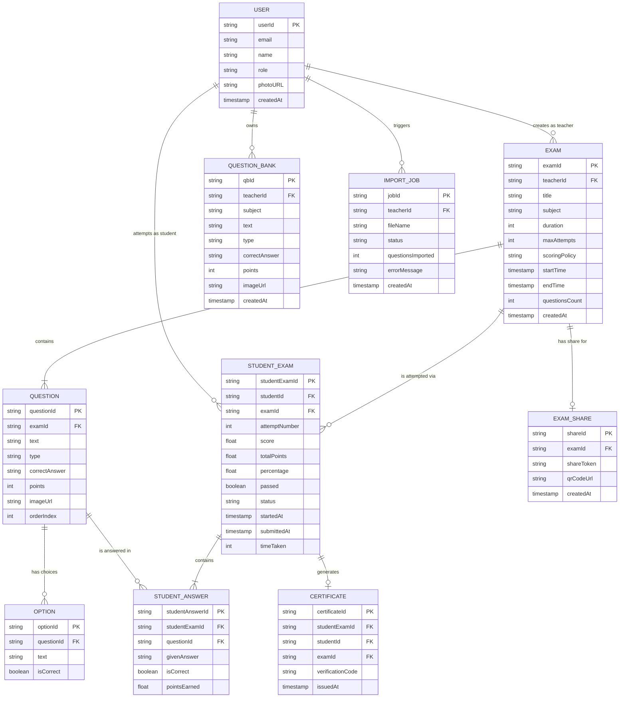
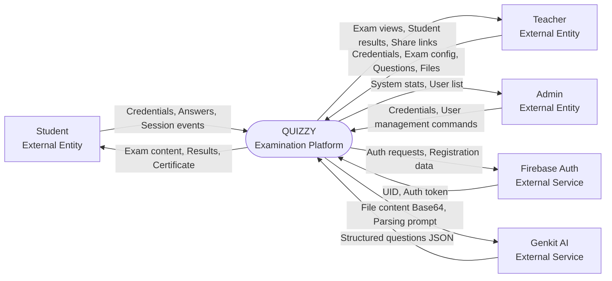
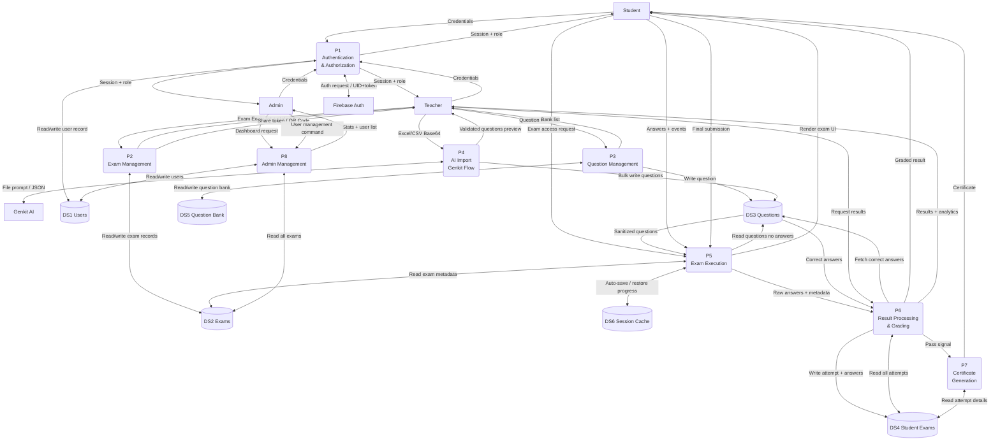
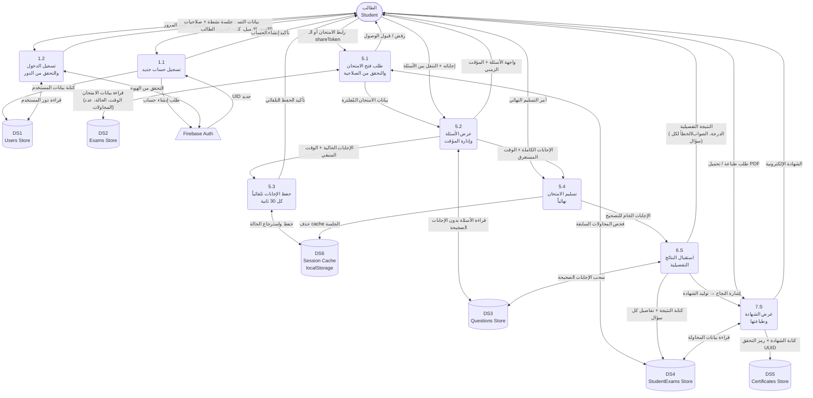
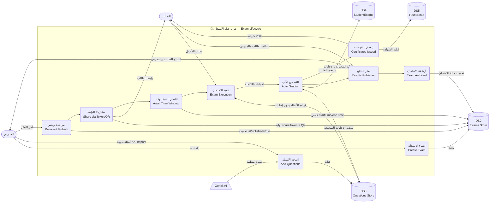

# 📐 Quizzy Platform — ERD & DFD Technical Specification

> **Project:** Quizzy — Academic E-Examination Platform  
> **Standard:** 3NF-Normalized Relational Model mapped from a Firestore NoSQL design  
> **Date:** 2026-04-07

---

## Table of Contents

1. [Entity-Relationship Diagram (ERD)](#1-entity-relationship-diagram-erd)
   - [1.1 Entities & Attributes](#11-entities--attributes)
   - [1.2 Relationships Summary](#12-relationships-summary)
   - [1.3 Mermaid ERD Diagram](#13-mermaid-erd-diagram)
2. [Data Flow Diagram (DFD)](#2-data-flow-diagram-dfd)
   - [2.1 Level 0 — Context Diagram](#21-level-0--context-diagram)
   - [2.2 Level 1 — Detailed DFD](#22-level-1--detailed-dfd)
   - [2.3 Structured Text DFD](#23-structured-text-dfd-supplementary)
3. [Design Assumptions & Notes](#3-design-assumptions--notes)

---

## 1. Entity-Relationship Diagram (ERD)

### 1.1 Entities & Attributes

#### USER
Stores all system users (students, teachers, admins). Role-based access is a single column, enabling clean Firestore security rules.

| Attribute | Type | Key | Notes |
|---|---|---|---|
| `userId` | STRING | **PK** | Firebase Auth UID |
| `email` | STRING | — | Unique, used for login |
| `name` | STRING | — | Display name |
| `role` | ENUM | — | `student | teacher | admin` |
| `photoURL` | STRING | — | Optional avatar URL |
| `createdAt` | TIMESTAMP | — | Account creation time |

#### EXAM
Represents an examination created by a teacher.

| Attribute | Type | Key | Notes |
|---|---|---|---|
| `examId` | STRING | **PK** | Firebase auto-ID |
| `teacherId` | STRING | **FK → USER** | Denormalized for security rules |
| `title` | STRING | — | Exam title |
| `subject` | STRING | — | Subject/course name |
| `duration` | INTEGER | — | Duration in minutes |
| `maxAttempts` | INTEGER | — | Max retry count per student |
| `scoringPolicy` | ENUM | — | `highest | average` |
| `startTime` | TIMESTAMP | — | Exam window opens |
| `endTime` | TIMESTAMP | — | Exam window closes |
| `questionsCount` | INTEGER | — | Cached count (denormalized) |
| `createdAt` | TIMESTAMP | — | — |

#### QUESTION
Individual questions belonging to an exam (sub-collection in Firestore).

| Attribute | Type | Key | Notes |
|---|---|---|---|
| `questionId` | STRING | **PK** | Firebase auto-ID |
| `examId` | STRING | **FK → EXAM** | Parent exam reference |
| `text` | STRING | — | Question body |
| `type` | ENUM | — | `multiple-choice | true-false | short-text` |
| `correctAnswer` | STRING | — | Correct answer value |
| `points` | INTEGER | — | Points awarded |
| `imageUrl` | STRING | — | Optional image URL |
| `orderIndex` | INTEGER | — | Display order |

#### OPTION
Answer choices for `multiple-choice` questions. Normalized out of QUESTION to satisfy 1NF/2NF.

| Attribute | Type | Key | Notes |
|---|---|---|---|
| `optionId` | STRING | **PK** | — |
| `questionId` | STRING | **FK → QUESTION** | Parent question |
| `text` | STRING | — | Option display text |
| `isCorrect` | BOOLEAN | — | Whether this is the correct choice |

#### QUESTION_BANK
A teacher's personal question repository, decoupled from specific exams.

| Attribute | Type | Key | Notes |
|---|---|---|---|
| `qbId` | STRING | **PK** | — |
| `teacherId` | STRING | **FK → USER** | Owning teacher |
| `subject` | STRING | — | Subject category tag |
| `text` | STRING | — | Question body |
| `type` | ENUM | — | `multiple-choice | true-false | short-text` |
| `correctAnswer` | STRING | — | Stored answer |
| `points` | INTEGER | — | Default point value |
| `imageUrl` | STRING | — | Optional image |
| `createdAt` | TIMESTAMP | — | — |

#### STUDENT_EXAM
Junction/fact table representing a single student's attempt at a specific exam. One row = one attempt.

| Attribute | Type | Key | Notes |
|---|---|---|---|
| `studentExamId` | STRING | **PK** | — |
| `studentId` | STRING | **FK → USER** | The student |
| `examId` | STRING | **FK → EXAM** | The exam attempted |
| `attemptNumber` | INTEGER | — | 1-based counter per student per exam |
| `score` | FLOAT | — | Points earned |
| `totalPoints` | FLOAT | — | Max possible points |
| `percentage` | FLOAT | — | score / totalPoints × 100 |
| `passed` | BOOLEAN | — | Pass/fail flag |
| `status` | ENUM | — | `in-progress | completed | expired` |
| `startedAt` | TIMESTAMP | — | When attempt began |
| `submittedAt` | TIMESTAMP | — | When attempt was submitted |
| `timeTaken` | INTEGER | — | Seconds elapsed |

#### STUDENT_ANSWER
Records each individual answer a student gave per question per attempt.

| Attribute | Type | Key | Notes |
|---|---|---|---|
| `studentAnswerId` | STRING | **PK** | — |
| `studentExamId` | STRING | **FK → STUDENT_EXAM** | The attempt context |
| `questionId` | STRING | **FK → QUESTION** | The question answered |
| `givenAnswer` | STRING | — | Student's selected/typed answer |
| `isCorrect` | BOOLEAN | — | Evaluated at submission time |
| `pointsEarned` | FLOAT | — | 0 or full question points |

#### CERTIFICATE
Issued automatically when a student passes an exam. One certificate per passing attempt.

| Attribute | Type | Key | Notes |
|---|---|---|---|
| `certificateId` | STRING | **PK** | — |
| `studentExamId` | STRING | **FK → STUDENT_EXAM** | Linked attempt |
| `studentId` | STRING | **FK → USER** | Denormalized for fast lookup |
| `examId` | STRING | **FK → EXAM** | Denormalized for display |
| `verificationCode` | STRING | — | Unique authenticity code |
| `issuedAt` | TIMESTAMP | — | — |

#### EXAM_SHARE
Stores the unique shareable token/QR reference for each exam.

| Attribute | Type | Key | Notes |
|---|---|---|---|
| `shareId` | STRING | **PK** | — |
| `examId` | STRING | **FK → EXAM** | The exam being shared |
| `shareToken` | STRING | — | Unique URL slug/token |
| `qrCodeUrl` | STRING | — | Generated QR image URL |
| `createdAt` | TIMESTAMP | — | — |

#### IMPORT_JOB
Tracks AI-powered question import operations for auditability.

| Attribute | Type | Key | Notes |
|---|---|---|---|
| `jobId` | STRING | **PK** | — |
| `teacherId` | STRING | **FK → USER** | Who triggered the import |
| `fileName` | STRING | — | Uploaded file name |
| `status` | ENUM | — | `pending | success | failed` |
| `questionsImported` | INTEGER | — | Count of successfully parsed questions |
| `errorMessage` | STRING | — | Failure details if any |
| `createdAt` | TIMESTAMP | — | — |

---

### 1.2 Relationships Summary

| Relationship | Entities | Cardinality | Notes |
|---|---|---|---|
| Teacher **creates** Exams | USER → EXAM | **1 : N** | One teacher, many exams |
| Exam **contains** Questions | EXAM → QUESTION | **1 : N** | Sub-collection in Firestore |
| Question **has** Options | QUESTION → OPTION | **1 : N** | Only for MCQ type |
| Student **attempts** Exams | USER ↔ EXAM | **M : N** | Via STUDENT_EXAM junction |
| Attempt **records** Answers | STUDENT_EXAM → STUDENT_ANSWER | **1 : N** | One answer per question per attempt |
| Answer **references** Question | STUDENT_ANSWER → QUESTION | **N : 1** | — |
| Attempt **generates** Certificate | STUDENT_EXAM → CERTIFICATE | **1 : 0\|1** | Only on passing attempt |
| Teacher **owns** Question Bank | USER → QUESTION_BANK | **1 : N** | Personal question repository |
| Exam **has** Share | EXAM → EXAM_SHARE | **1 : 0\|1** | Optional; generated on demand |
| Teacher **triggers** Import Job | USER → IMPORT_JOB | **1 : N** | AI import audit trail |

---

### 1.3 Mermaid ERD Diagram

---

## 2. Data Flow Diagram (DFD)

> **Note:** Mermaid does not natively support Yourdon/DeMarco DFD notation. The diagrams below use `flowchart` syntax with semantic node shapes:
> - **Rectangles** `[...]` — External Entities
> - **Rounded rectangles** `(...)` — Processes
> - **Cylinders** `[(...)]` — Data Stores
> - **Labeled arrows** — Data Flows

---

### 2.1 Level 0 — Context Diagram

---

### 2.2 Level 1 — Detailed DFD

**Data Stores:**
| ID | Name | Firestore Path |
|---|---|---|
| DS1 | Users Store | `users` collection |
| DS2 | Exams Store | `exams` collection |
| DS3 | Questions Store | `exams/{id}/questions` sub-collection |
| DS4 | Student Exams Store | `studentExams` collection |
| DS5 | Question Bank | `questionBank` collection |
| DS6 | Session Cache | Browser `localStorage` |

---

### 2.3 Structured Text DFD (Supplementary)

#### P1 — User Authentication & Authorization
| # | Source | Data Flow | Destination |
|---|---|---|---|
| 1.1 | Student / Teacher / Admin | `email + password` | P1 |
| 1.2 | P1 | `auth token request` | Firebase Auth |
| 1.3 | Firebase Auth | `UID + auth token` | P1 |
| 1.4 | P1 | `read user by UID` | DS1 |
| 1.5 | DS1 | `user record (role, name, photoURL)` | P1 |
| 1.6 | P1 | `authenticated session + role` | Student / Teacher / Admin |
| 1.7 | P1 (new registration) | `new user document` | DS1 |

#### P2 — Exam Management
| # | Source | Data Flow | Destination |
|---|---|---|---|
| 2.1 | Teacher | `exam config (title, subject, duration, window, attempts, scoring)` | P2 |
| 2.2 | P2 | `write new exam record` | DS2 |
| 2.3 | P2 | `read exam list by teacherId` | DS2 |
| 2.4 | DS2 | `teacher's exam list` | P2 |
| 2.5 | P2 | `exam list + computed status` | Teacher |
| 2.6 | Teacher | `share / delete command` | P2 |
| 2.7 | P2 | `generated share token + QR Code URL` | Teacher |
| 2.8 | P2 | `delete exam document` | DS2 |

#### P3 — Question Management
| # | Source | Data Flow | Destination |
|---|---|---|---|
| 3.1 | Teacher | `question data (text, type, options, points, imageUrl)` | P3 |
| 3.2 | P3 | `write question document` | DS3 |
| 3.3 | P3 | `write to question bank` | DS5 |
| 3.4 | Teacher | `request question bank list` | P3 |
| 3.5 | P3 | `read questions (filter/search)` | DS5 |
| 3.6 | DS5 | `question bank records` | P3 |
| 3.7 | P3 | `question bank display` | Teacher |

#### P4 — AI Question Import (Genkit)
| # | Source | Data Flow | Destination |
|---|---|---|---|
| 4.1 | Teacher | `Excel/CSV file (Base64-encoded)` | P4 |
| 4.2 | P4 | `file content + Zod schema + parsing prompt` | Genkit AI |
| 4.3 | Genkit AI | `parsed & structured questions JSON` | P4 |
| 4.4 | P4 | `Zod-validated question array` | Teacher (pre-fills form) |
| 4.5 | Teacher (confirm) | `approve import` | P4 |
| 4.6 | P4 | `bulk write question documents` | DS3 |

#### P5 — Exam Execution
| # | Source | Data Flow | Destination |
|---|---|---|---|
| 5.1 | Student | `exam access request (examId)` | P5 |
| 5.2 | P5 | `read exam metadata` | DS2 |
| 5.3 | DS2 | `exam config (duration, window)` | P5 |
| 5.4 | P5 | `read questions — NO correctAnswer field` | DS3 |
| 5.5 | DS3 | `sanitized question data` | P5 |
| 5.6 | P5 | `render exam UI (questions, timer)` | Student |
| 5.7 | Student | `answer selections + navigation events` | P5 |
| 5.8 | P5 (every 30s) | `save answers + remaining time` | DS6 |
| 5.9 | DS6 | `restore in-progress state on reload` | P5 |
| 5.10 | Student / Timer | `final submission event` | P5 |
| 5.11 | P5 | `raw answers + timeTaken` | P6 |
| 5.12 | P5 | `clear session entry` | DS6 |

#### P6 — Result Processing & Grading
| # | Source | Data Flow | Destination |
|---|---|---|---|
| 6.1 | P5 | `raw answers + examId + studentId` | P6 |
| 6.2 | P6 | `fetch correctAnswer for each questionId` | DS3 |
| 6.3 | DS3 | `correct answers` | P6 |
| 6.4 | P6 (internal) | `compute isCorrect, pointsEarned, score, percentage, passed` | P6 |
| 6.5 | P6 | `write STUDENT_EXAM + STUDENT_ANSWER records` | DS4 |
| 6.6 | P6 | `graded result summary` | Student |
| 6.7 | P6 | `pass signal + studentExamId` | P7 |
| 6.8 | Teacher | `request student results for exam` | P6 |
| 6.9 | P6 | `read all attempt records` | DS4 |
| 6.10 | DS4 | `attempt records` | P6 |
| 6.11 | P6 | `results table + analytics` | Teacher |

#### P7 — Certificate Generation
| # | Source | Data Flow | Destination |
|---|---|---|---|
| 7.1 | P6 | `studentExamId + passed=true` | P7 |
| 7.2 | P7 | `read student + exam details` | DS4 / DS1 / DS2 |
| 7.3 | P7 | `write certificate record (with verificationCode)` | DS4 |
| 7.4 | P7 | `rendered certificate (name, exam, date, score)` | Student |
| 7.5 | Student | `print / download trigger` | P7 |

#### P8 — Admin System Management
| # | Source | Data Flow | Destination |
|---|---|---|---|
| 8.1 | Admin | `request system dashboard` | P8 |
| 8.2 | P8 | `read all users` | DS1 |
| 8.3 | P8 | `read all exams` | DS2 |
| 8.4 | DS1 + DS2 | `aggregate counts + lists` | P8 |
| 8.5 | P8 | `system stats (users, exams, activity)` | Admin |
| 8.6 | Admin | `user management command (add/edit/delete/role)` | P8 |
| 8.7 | P8 | `write user record changes` | DS1 |
| 8.8 | P8 | `updated user list` | Admin |

---

## 2.4 Level 2 — مخططات DFD التفصيلية لكل كيان

> **المستوى الثاني (Level 2)** يُفصّل العمليات الداخلية لكل طرف (Actor) على حدة،
> مع إظهار كامل تدفق البيانات الداخلة والخارجة من كل عملية فرعية.

---

### 🎓 DFD-2A — الطالب (Student)

---

### 🧑‍🏫 DFD-2B — المدرس (Teacher)

```mermaid
flowchart TD
    T(["المدرس\nTeacher"])

    DS1[("DS1\nUsers Store")]
    DS2[("DS2\nExams Store")]
    DS3[("DS3\nQuestions Store")]
    DS4[("DS4\nStudentExams Store")]
    DS5[("DS5\nQuestion Bank")]
    AI[/"Genkit AI\nGemini 1.5 Flash"\]
    FB[/"Firebase Auth"\]

    P1_T("1.T\nتسجيل الدخول\nوالتحقق من دور المدرس")
    P2_1("2.1\nإنشاء امتحان جديد\nوضبط الإعدادات")
    P2_2("2.2\nإدارة الامتحانات\n(تعديل / نشر / حذف / مشاركة)")
    P3_1("3.1\nإضافة أسئلة يدوياً\nللامتحان أو البنك")
    P3_2("3.2\nاستيراد أسئلة من Excel\nعبر الذكاء الاصطناعي")
    P3_3("3.3\nإدارة بنك الأسئلة")
    P6_T("6.T\nاستعراض نتائج الطلاب\nوالتحليلات")

    T -->|"الإيميل + كلمة المرور"| P1_T
    P1_T <-->|"التحقق من الهوية"| FB
    P1_T <-->|"التحقق من دور = teacher"| DS1
    P1_T -->|"جلسة نشطة + صلاحيات المدرس"| T

    T -->|"إعدادات الامتحان\n(العنوان، المادة، المدة، النافذة الزمنية)"| P2_1
    P2_1 -->|"كتابة سجل الامتحان الجديد"| DS2
    P2_1 -->|"تأكيد الإنشاء + رقم الامتحان"| T

    T -->|"أمر التعديل / النشر / الحذف / المشاركة"| P2_2
    P2_2 <-->|"قراءة وتحديث بيانات الامتحان"| DS2
    P2_2 -->|"رابط المشاركة + QR Code"| T
    P2_2 -->|"قائمة امتحاناته + حالة كل امتحان"| T

    T -->|"بيانات السؤال\n(النص، النوع، الخيارات، الدرجة)"| P3_1
    P3_1 -->|"كتابة السؤال في الامتحان"| DS3
    P3_1 -->|"حفظ نسخة في البنك (اختياري)"| DS5
    P3_1 -->|"تأكيد الإضافة"| T

    T -->|"ملف Excel/CSV"| P3_2
    P3_2 -->|"محتوى الملف + Prompt التحليل"| AI
    AI -->|"أسئلة منظمة JSON"| P3_2
    P3_2 -->|"معاينة الأسئلة المستوردة"| T
    T -->|"تأكيد الاستيراد"| P3_2
    P3_2 -->|"كتابة الأسئلة دفعةً واحدة"| DS3

    T -->|"طلب عرض / بحث / حذف من البنك"| P3_3
    P3_3 <-->|"قراءة وتعديل وحذف أسئلة البنك"| DS5
    P3_3 -->|"قائمة أسئلة البنك"| T

    T -->|"طلب نتائج امتحان معين"| P6_T
    P6_T <-->|"قراءة كل محاولات الامتحان"| DS4
    P6_T <-->|"قراءة بيانات الأسئلة للمقارنة"| DS3
    P6_T -->|"جدول النتائج\n(اسم الطالب، الدرجة، الوقت)"| T
    P6_T -->|"تحليلات إحصائية\n(توزيع الدرجات، نسبة النجاح)"| T
```

---

### 📋 DFD-2C — الامتحان (Exam) — دورة حياة كاملة

---

### 🛡️ DFD-2D — المشرف (Admin)

```mermaid
flowchart TD
    A(["المشرف\nAdmin"])

    DS1[("DS1\nUsers Store")]
    DS2[("DS2\nExams Store")]
    DS4[("DS4\nStudentExams")]
    FB[/"Firebase Auth"\]

    P1_A("1.A\nتسجيل دخول المشرف\nوالتحقق من الدور")
    P8_1("8.1\nlوحة الإحصاءات\nالرئيسية")
    P8_2("8.2\nإدارة المستخدمين\n(عرض / إنشاء / تعديل / حذف)")
    P8_3("8.3\nإدارة الأدوار\nوالحالات")
    P8_4("8.4\nمراقبة الامتحانات\nعلى مستوى النظام")
    P8_5("8.5\nتقارير النظام\nوالإحصاءات الشاملة")
    P8_6("8.6\nإدارة الصلاحيات\nوالوصول")

    A -->|"بيانات دخول المشرف"| P1_A
    P1_A <-->|"التحقق من الهوية"| FB
    P1_A <-->|"التحقق من دور = admin"| DS1
    P1_A -->|"جلسة نشطة + صلاحيات المشرف الكاملة"| A

    A -->|"طلب لوحة التحكم"| P8_1
    P8_1 <-->|"إجمالي المستخدمين + الفئات"| DS1
    P8_1 <-->|"إجمالي الامتحانات + الحالات"| DS2
    P8_1 <-->|"إجمالي المحاولات + النتائج"| DS4
    P8_1 -->|"ملخص النظام\n(بطاقات الإحصاء + الرسوم البيانية)"| A

    A -->|"طلب قائمة المستخدمين\n(بحث / فلترة)"| P8_2
    P8_2 <-->|"قراءة / كتابة بيانات المستخدمين"| DS1
    P8_2 <-->|"إنشاء / حذف حساب"| FB
    P8_2 -->|"قائمة المستخدمين التفصيلية"| A

    A -->|"أمر تغيير الدور أو الحالة"| P8_3
    P8_3 -->|"تحديث role / status"| DS1
    P8_3 -->|"تأكيد التحديث"| A

    A -->|"طلب استعراض امتحانات النظام"| P8_4
    P8_4 <-->|"قراءة كل الامتحانات بغض النظر عن المدرس"| DS2
    P8_4 <-->|"قراءة المحاولات المرتبطة"| DS4
    P8_4 -->|"قائمة امتحانات النظام + المقاييس"| A
    A -->|"أمر تعطيل / حذف امتحان"| P8_4
    P8_4 -->|"تحديث / حذف سجل الامتحان"| DS2

    A -->|"طلب تقرير شامل"| P8_5
    P8_5 <-->|"تجميع البيانات من كل المخازن"| DS1
    P8_5 <-->|"تجميع البيانات من كل المخازن"| DS2
    P8_5 <-->|"تجميع البيانات من كل المخازن"| DS4
    P8_5 -->|"تقرير PDF أو جدول\n(معدلات النجاح، أكثر المواد نشاطاً)"| A

    A -->|"إعدادات صلاحيات النظام"| P8_6
    P8_6 -->|"تحديث قواعد الوصول"| DS1
    P8_6 -->|"تأكيد تطبيق الصلاحيات"| A
```

---

## 3. Design Assumptions & Notes

> [!NOTE]
> **Assumption A — 3NF Normalization of Options:** The original Firestore model stores options as an array inside QUESTION. In a relational 3NF design, these are extracted into a separate **OPTION** table to eliminate repeating groups (1NF violation).

> [!NOTE]
> **Assumption B — STUDENT_ANSWER as Separate Table:** Answers were described as an array inside `studentExams` in Firestore. In the relational model, each answer is a separate row in **STUDENT_ANSWER**, enabling per-question analytics.

> [!NOTE]
> **Assumption C — CERTIFICATE linked to STUDENT_EXAM:** A certificate is tied to a specific attempt to correctly capture which attempt score earned it, supporting both `highest` and `average` scoring policies.

> [!NOTE]
> **Assumption D — Name field on USER:** The `name` field is assumed on USER. The original spec mentions `photoURL` and `email` but not a display name — which is required for certificate generation.

> [!IMPORTANT]
> **Security Critical — Answer Masking in P5:** During exam execution (P5), the `correctAnswer` field is **never sent to the client**. Answers are retrieved server-side only in P6 (grading). This is enforced via Firestore Security Rules and is the key anti-cheating mechanism.

> [!TIP]
> **Scalability — Denormalized Fields:** Fields like `teacherId` on EXAM and `studentId/examId` on CERTIFICATE are intentionally denormalized. In Firestore, this avoids expensive JOIN-equivalent queries and enables efficient Security Rule evaluation without extra `get()` calls.

> [!NOTE]
> **Assumption E — IMPORT_JOB Table:** Not explicitly mentioned in the spec but implied by the AI import feature. This table provides an audit trail for debugging failed imports and monitoring AI usage.
