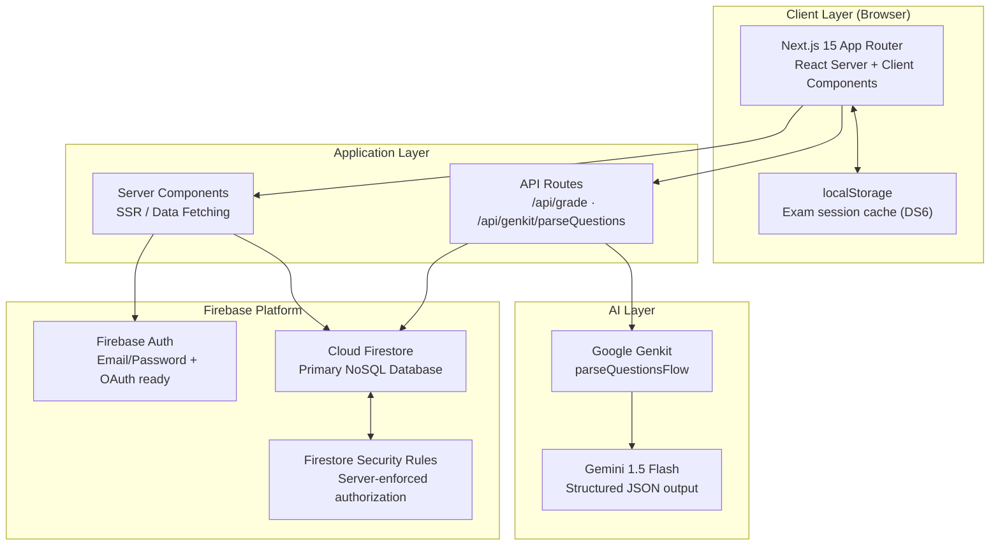
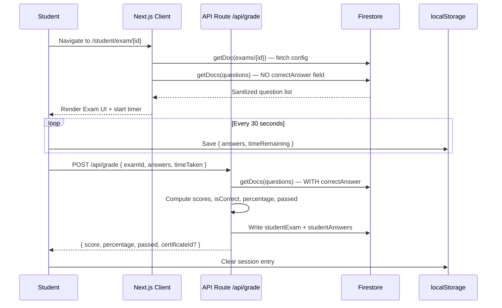
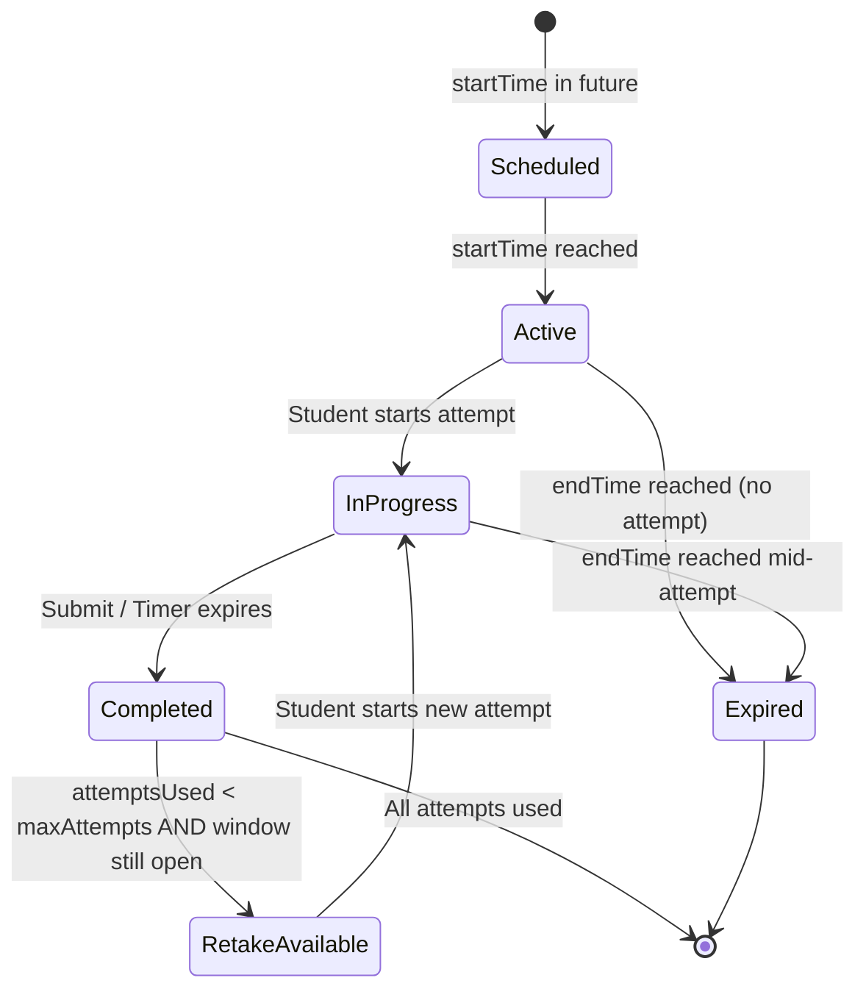
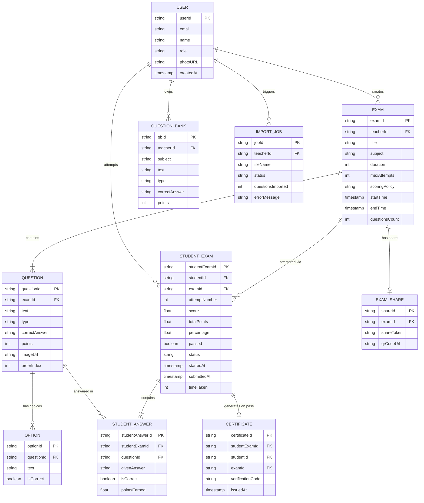
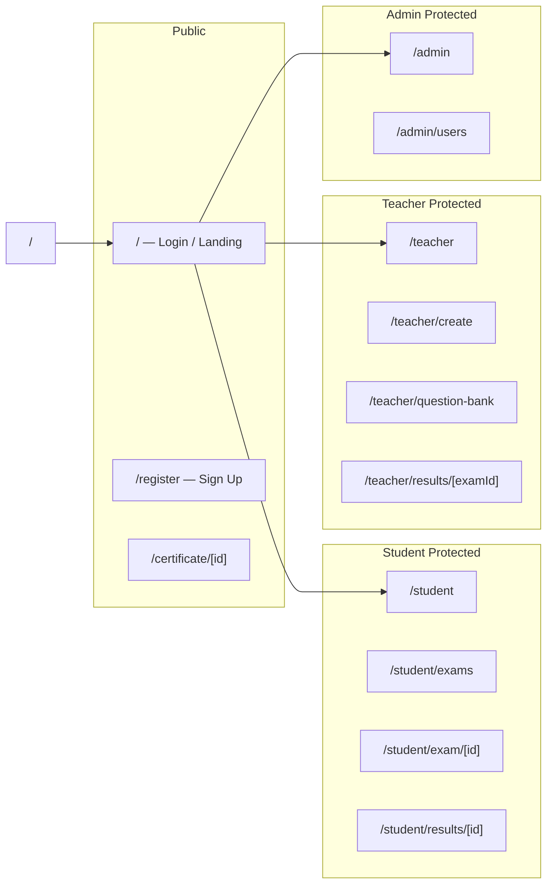
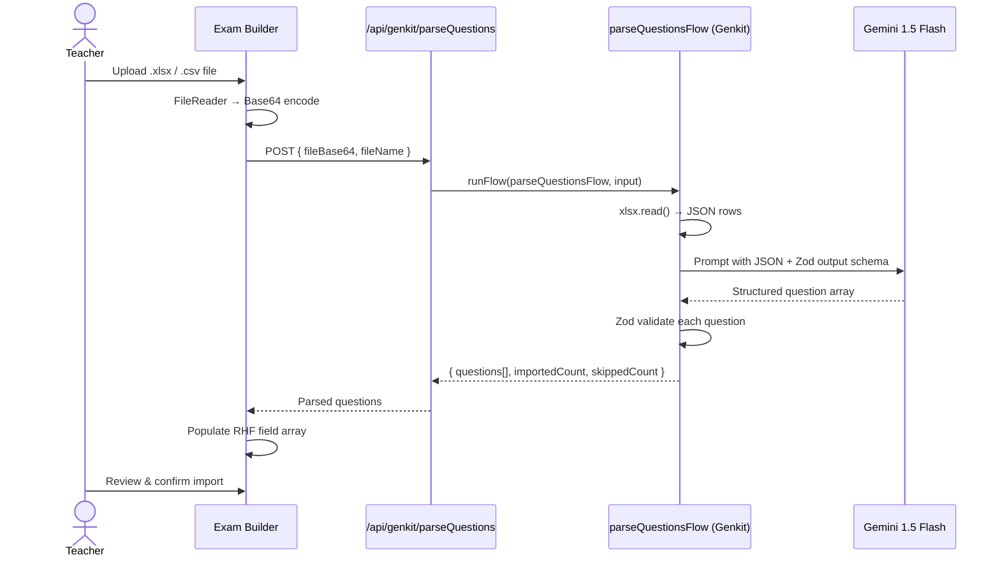

<div align="center">

<br />

```
  ██████╗ ██╗   ██╗██╗███████╗███████╗██╗   ██╗
 ██╔═══██╗██║   ██║██║╚══███╔╝╚══███╔╝╚██╗ ██╔╝
 ██║   ██║██║   ██║██║  ███╔╝   ███╔╝  ╚████╔╝
 ██║▄▄ ██║██║   ██║██║ ███╔╝   ███╔╝    ╚██╔╝
 ╚██████╔╝╚██████╔╝██║███████╗███████╗   ██║
  ╚══▀▀═╝  ╚═════╝ ╚═╝╚══════╝╚══════╝   ╚═╝
```

### Academic E-Examination Platform

**A full-stack, AI-powered examination platform for the modern digital classroom.**  
Built for institutions, designed for teachers, optimized for students.

<br />


<br />

[Live Demo](#) · [Report Bug](#) · [Request Feature](#) · [Documentation](#)

</div>

---

## 📋 Table of Contents

1. [Overview](#-overview)
2. [The Problem We're Solving](#-the-problem-were-solving)
3. [Key Features](#-key-features)
4. [System Architecture](#-system-architecture)
5. [Technology Stack](#-technology-stack)
6. [Data Model](#-data-model)
7. [Application Routes](#-application-routes)
8. [Project Structure](#-project-structure)
9. [Getting Started](#-getting-started)
10. [Environment Variables](#-environment-variables)
11. [AI-Powered Import](#-ai-powered-import)
12. [Security Model](#-security-model)
13. [UI/UX Design System](#-uiux-design-system)
14. [Roadmap](#-roadmap)

---

## 🎯 Overview

**Quizzy** is a comprehensive, enterprise-grade academic examination platform engineered to replace paper-based testing with a seamless digital experience. It delivers **three purpose-built portals** — one for each role — backed by a Firebase BaaS infrastructure and augmented by Google Genkit AI for intelligent question importing.

### Role-Based Capability Matrix

| Capability | 🎓 Student | 📚 Teacher | 🛡️ Admin |
|---|:---:|:---:|:---:|
| Take live timed exams | ✅ | — | — |
| Auto-save progress to `localStorage` | ✅ | — | — |
| View graded results with answer review | ✅ | — | — |
| Flag questions for review during exam | ✅ | — | — |
| Print/download achievement certificate | ✅ | — | — |
| Create & schedule exams with time windows | — | ✅ | — |
| Build & manage personal question bank | — | ✅ | — |
| AI bulk import from Excel/CSV (Genkit) | — | ✅ | — |
| Share exams via unique link or QR Code | — | ✅ | — |
| View per-exam student analytics | — | ✅ | — |
| Manage all platform users & roles | — | — | ✅ |
| System-wide statistics dashboard | — | — | ✅ |

> **Design Principle:** Each portal is rendered inside a role-isolated layout group. A student navigating to `/teacher/create` is automatically redirected — this is enforced both client-side (layout guard) and server-side (Firestore Security Rules).

---

## 🚧 The Problem We're Solving

Educational institutions worldwide still rely on paper-based examinations — a process riddled with inefficiencies:

| Pain Point | Impact |
|---|---|
| **Logistics overhead** | Printing, distributing, collecting, and manually grading papers consumes enormous staff time |
| **Limited question formats** | Paper cannot embed multimedia (images, video, audio) effectively |
| **Security & integrity risks** | Paper exams are vulnerable to leaks and in-room cheating |
| **No real-time analytics** | Impossible to quickly extract per-student or per-question performance data |
| **Environmental cost** | High paper and printing resource consumption |

**Quizzy** resolves all of the above in a single, unified platform: secure, real-time, analytics-ready, and fully digital.

---

## ✨ Key Features

### 🎓 Student Portal

#### Exam Dashboard (`/student`)
- Analytics cards for the *last completed exam*: score, class rank *(upcoming)*, correct answers count
- Quick-view list of the 3 most recent exam results with direct links

#### Exam List (`/student/exams`)
Dynamic status cards computed in real-time from exam schedule and student attempt data:

| Status | Color | Condition |
|---|---|---|
| `Scheduled` | 🔵 Blue | Exam window hasn't opened yet — button disabled |
| `Start Now` | 🟢 Green | Window is open, no attempt started yet |
| `In Progress` | 🟡 Yellow | Attempt detected in `localStorage` |
| `Retake Available` | 🟠 Orange | Attempt completed but retakes remain & window is open |
| `Completed` | ⚫ Grey | All allowed attempts exhausted |
| `Expired` | 🔴 Red | Window closed with no completed attempt |

#### Exam Engine (`/student/exam/[id]`)
- **Animated question transitions** powered by `Framer Motion`
- **Countdown timer** with color-shift warning at < 2 minutes remaining
- **Auto-submit** when timer reaches zero
- **Auto-save every 30 seconds** to `localStorage` — survives browser crashes or network loss
- **Question Navigator Panel** — grid of numbered buttons, color-coded by state (answered / flagged / current)
- **Flag for Review** — mark any question to revisit before final submission

#### Results & Certificate (`/student/results/[id]`, `/certificate/[id]`)
- Score summary: raw score, percentage, time taken, pass/fail badge
- Full accordion-style answer review with ✅/❌ indicators and correct answer reveal
- Printable digital certificate with unique verification code (`@media print` optimized)

---

### 📚 Teacher Portal

#### Teacher Dashboard (`/teacher`)
- All created exams table with live status badges
- Quick stats: total exams, pending manual review count *(future: essay grading)*
- Per-exam actions: View Analytics, Share (link + QR Code), Delete with confirmation

#### Exam Builder (`/teacher/create`)
Built with `React Hook Form` + `Zod` for real-time, schema-driven validation:
- Exam metadata: title, subject, duration (minutes)
- **Scheduling:** Date-time pickers for open/close window
- **Exam policies:** max attempts, scoring method (`highest` or `average` across retakes)
- **Dynamic question editor:** supports 3 question types:
  - `Multiple Choice` — 4 options, radio-select the correct one
  - `True / False` — toggle switch
  - `Short Text` — open-ended expected answer
- Optional image URL per question
- **Bulk import via AI** (see [AI-Powered Import](#-ai-powered-import))

#### Question Bank (`/teacher/question-bank`)
Centralized personal question repository with search and filter capabilities, enabling question reuse across multiple exams.

---

### 🛡️ Admin Portal

#### System Dashboard (`/admin`)
- Platform-wide aggregated stats: total users, total exams, currently active exams, latest registrations

#### User Management (`/admin/users`)
Full CRUD operations on system users via an interactive data table:
- Add, edit role, and delete users
- Search by name/email, filter by role
- Role assignment: instantly promote a student account to teacher

---

## 🏗️ System Architecture

### High-Level Architecture



### Exam Execution Sequence



### Exam Status State Machine



---

## 🛠️ Technology Stack

| Layer | Technology | Version | Rationale |
|---|---|---|---|
| **Framework** | Next.js (App Router) | 15.5.9 | RSC for server-side data fetching, nested layout isolation per role, Turbopack for fast DX |
| **Language** | TypeScript | ^5.x | Compile-time safety; Zod schemas shared between form validation and server-side grading |
| **Styling** | Tailwind CSS | ^3.4 | Utility-first, pairs perfectly with ShadCN's class-based theming system |
| **UI Library** | ShadCN UI (Radix UI) | Latest | Accessible, headless, fully owned in codebase — complete customization control |
| **Animations** | Framer Motion | ^11.x | Smooth question transitions and staggered dashboard animations |
| **Database** | Firebase Firestore | ^11.x | NoSQL real-time; sub-collections match exam→questions hierarchy naturally |
| **Auth** | Firebase Auth | ^11.x | Battle-tested; supports Email/Password today + Google/SSO tomorrow with zero refactoring |
| **Forms** | React Hook Form + Zod | ^7.x + ^3.x | Zero-rerender uncontrolled inputs; single Zod schema used for both form and API validation |
| **Data Tables** | TanStack Table | ^8.x | Headless, virtualization-ready; ideal for large user/results lists |
| **Charts** | Recharts | ^2.x | React-native charting for analytics dashboards |
| **AI** | Google Genkit + Gemini 1.5 Flash | ^1.20 | Firebase-native AI framework; typed I/O flows; structured output for document→JSON tasks |
| **QR Code** | qrcode.react | ^3.x | SVG-based accessible QR generation for exam sharing |
| **File Parsing** | xlsx | ^0.18 | Server-side Excel/CSV parsing inside the Genkit flow |
| **Global State** | Zustand | ^4.5 | Minimal boilerplate; replaces Context prop-drilling for theme, direction, user data |
| **Email** | Resend | ^3.x | Transactional email for future notification features |

---

## 🗄️ Data Model

### Entity Relationship Diagram



### Firestore Collection Structure

```
Firestore Root
│
├── users/{userId}                   ← All platform users
├── exams/{examId}                   ← All exams
│   └── questions/{questionId}       ← Sub-collection (correctAnswer guarded by rules)
├── studentExams/{studentExamId}     ← All attempt records
├── questionBank/{qbId}              ← Teacher question repositories
├── certificates/{certificateId}     ← Issued pass certificates
├── examShares/{shareId}             ← QR + URL share tokens
└── importJobs/{jobId}               ← AI import audit log
```

> **Security Note:** The `correctAnswer` field on `QUESTION` documents is **never sent to the browser** during exam execution. It is only accessed server-side in the API Route grading pipeline — enforced by both field masking and Firestore Security Rules.

---

## 🗺️ Application Routes



| Route | Access | Description |
|---|---|---|
| `/` | Public | Landing page + Login form |
| `/register` | Public | Sign-up form |
| `/student` | Student | Dashboard with recent exam analytics |
| `/student/exams` | Student | All available exams with status cards |
| `/student/exam/[id]` | Student | Live exam execution engine |
| `/student/results/[id]` | Student | Graded result + answer review |
| `/certificate/[id]` | Public | Printable achievement certificate |
| `/teacher` | Teacher | Dashboard with exam management table |
| `/teacher/create` | Teacher | Full exam builder form |
| `/teacher/question-bank` | Teacher | Personal question repository |
| `/teacher/results/[examId]` | Teacher | All student attempts analytics |
| `/admin` | Admin | System-wide statistics |
| `/admin/users` | Admin | User CRUD + role management |
| `/profile` | All roles | User profile settings |

---

## 📁 Project Structure

```
src/
├── app/
│   ├── layout.tsx                    ← Root HTML shell, fonts, global providers
│   ├── page.tsx                      ← Landing / Login page
│   ├── globals.css                   ← Design tokens, CSS variables, Tailwind base
│   │
│   ├── (auth)/                       ← Public auth pages (no sidebar)
│   │   └── register/page.tsx
│   │
│   ├── (app)/                        ← Protected pages (auth + role guard)
│   │   ├── layout.tsx                ← Sidebar + Header + 2-stage auth guard
│   │   ├── profile/page.tsx
│   │   ├── student/
│   │   │   ├── page.tsx              ← Student Dashboard
│   │   │   ├── exams/page.tsx        ← Exam list with dynamic status
│   │   │   ├── exam/[id]/page.tsx    ← Exam execution engine
│   │   │   └── results/[id]/page.tsx ← Results + answer review
│   │   ├── teacher/
│   │   │   ├── page.tsx              ← Teacher Dashboard
│   │   │   ├── create/page.tsx       ← Exam builder
│   │   │   ├── question-bank/page.tsx
│   │   │   └── results/[examId]/page.tsx
│   │   └── admin/
│   │       ├── page.tsx              ← System stats
│   │       └── users/page.tsx        ← User management
│   │
│   ├── certificate/[id]/page.tsx     ← Public, print-ready certificate
│   │
│   └── api/
│       └── genkit/parseQuestions/route.ts  ← AI import endpoint
│
├── ai/
│   ├── genkit.ts                     ← Genkit instance + Gemini plugin config
│   ├── dev.ts                        ← Local Genkit server entry
│   └── flows/
│       └── parseQuestionsFlow.ts     ← Typed AI flow with Zod I/O schema
│
├── components/
│   ├── providers.tsx                 ← App context: theme, language direction
│   ├── logo.tsx                      ← Quizzy brand mark
│   ├── FirebaseErrorListener.tsx     ← Global error toast handler
│   └── ui/                           ← All ShadCN UI primitives
│
├── firebase/
│   ├── index.ts                      ← Firebase app initialization
│   └── provider.tsx                  ← React context for auth + firestore instances
│
├── hooks/
│   ├── useExamTimer.ts               ← Countdown timer with auto-submit
│   ├── useExamSession.ts             ← localStorage save/restore/clear
│   └── useRole.ts                    ← Reads current user role from Firestore
│
└── lib/
    ├── types.ts                      ← All TypeScript interfaces and enums
    ├── utils.ts                      ← Utility helpers (cn, formatters)
    ├── constants.ts                  ← Pass threshold, role enum, config
    └── schemas.ts                    ← Shared Zod schemas (form ↔ API)
```

---

## 🚀 Getting Started

### Prerequisites

- **Node.js** `>= 20.x`
- **npm** `>= 10.x`
- A **Firebase project** (Firestore + Authentication enabled)
- A **Google AI API Key** (for Genkit / Gemini)

### Installation

```bash
# 1. Clone the repository
git clone https://github.com/your-org/quizzy.git
cd quizzy

# 2. Install dependencies
npm install

# 3. Set up environment variables
cp .env.example .env.local
# → Fill in your Firebase config and GOOGLE_GENAI_API_KEY

# 4. Start the development server (Turbopack)
npm run dev
# → App running at http://localhost:9002

# 5. (Optional) Start Genkit AI dev server
npm run genkit:dev
# → Genkit UI at http://localhost:4000
```

### Available Scripts

| Command | Description |
|---|---|
| `npm run dev` | Start Next.js dev server with Turbopack on port `9002` |
| `npm run build` | Build production bundle |
| `npm run start` | Start production server |
| `npm run lint` | Run ESLint checks |
| `npm run typecheck` | TypeScript type-check without emitting |
| `npm run genkit:dev` | Start Genkit development server |
| `npm run genkit:watch` | Start Genkit with file watching |

---

## 🔐 Environment Variables

Create a `.env.local` file in the project root with the following:

```env
# ── Firebase Client Config ─────────────────────────────────
NEXT_PUBLIC_FIREBASE_API_KEY=your_api_key
NEXT_PUBLIC_FIREBASE_AUTH_DOMAIN=your_project.firebaseapp.com
NEXT_PUBLIC_FIREBASE_PROJECT_ID=your_project_id
NEXT_PUBLIC_FIREBASE_STORAGE_BUCKET=your_project.appspot.com
NEXT_PUBLIC_FIREBASE_MESSAGING_SENDER_ID=your_sender_id
NEXT_PUBLIC_FIREBASE_APP_ID=your_app_id

# ── Google AI (Genkit / Gemini) ────────────────────────────
GOOGLE_GENAI_API_KEY=your_gemini_api_key
```

> [!CAUTION]
> Never commit `.env.local` to source control. The `GOOGLE_GENAI_API_KEY` is server-only and must never be prefixed with `NEXT_PUBLIC_`.

---

## 🤖 AI-Powered Import

Quizzy integrates **Google Genkit** to allow teachers to import questions in bulk from existing Excel or CSV files — turning hours of manual entry into seconds.

### How It Works



### Expected Excel Format

| Column | Required | Notes |
|---|:---:|---|
| `text` | ✅ | Full question text |
| `type` | ✅ | `multiple-choice` / `true-false` / `short-text` |
| `correctAnswer` | ✅ | Correct answer as a string |
| `points` | ✅ | Integer — points awarded for correct answer |
| `option1` – `option4` | ➡️ MCQ | Only required for `multiple-choice` type |
| `imageUrl` | ❌ | Optional URL to a question image |

---

## 🔒 Security Model

Security is enforced at **two independent layers** — neither can be bypassed:

### Layer 1: Client-Side (UI Gating)
- The `(app)/layout.tsx` checks the logged-in user's role from Firestore
- Any mismatch between role and route triggers an immediate redirect
- Navigation menus only render links valid for the current role

### Layer 2: Server-Side (Firestore Security Rules)
No client-side manipulation can circumvent these rules — they are evaluated by Firebase's servers.

```javascript
// Example: Only exam owner (teacher) can modify their exam
match /exams/{examId} {
  allow update, delete: if request.auth != null
                        && resource.data.teacherId == request.auth.uid;
}

// Example: correctAnswer is in the document, but grading
// only happens in the server-side API Route — never client-side
match /exams/{examId}/questions/{questionId} {
  allow read: if request.auth != null;
  // write is restricted to the exam's teacher
}

// Example: Certificates are public read but server-write only
match /certificates/{certificateId} {
  allow read: if true;
  allow write: if false; // Written only by API Route
}
```

### Key Security Guarantees

| Guarantee | Mechanism |
|---|---|
| `correctAnswer` never reaches the browser during exam | API Route grading + field masking |
| Final score always computed server-side | Grading in `/api/grade`, never trusted from client |
| Cross-role page access blocked | Layout guard + Firestore rule deny |
| Users cannot escalate their own role | Firestore rule: only `admin` can write `role` field |
| Certificates cannot be forged | Server-generated `verificationCode`, write-blocked on client |

---

## 🎨 UI/UX Design System

### Design Philosophy
- **Clarity first:** Distraction-free exam environment. Every pixel serves a purpose.
- **Consistency:** A unified visual language across all three portals.
- **Responsive:** Works seamlessly from a 320px mobile screen to a 4K desktop monitor.
- **Accessible:** Built on Radix UI primitives — keyboard navigable, ARIA-compliant.

### Color Tokens

| Token | Light Mode | Dark Mode | Purpose |
|---|---|---|---|
| `--primary` | `hsl(221 83% 53%)` | `hsl(217 91% 60%)` | CTAs, active nav, links |
| `--accent` | `hsl(262 83% 67%)` | `hsl(262 80% 72%)` | Logo highlight, badges |
| `--background` | `hsl(0 0% 100%)` | `hsl(222 47% 11%)` | Page background |
| `--muted` | `hsl(210 40% 96%)` | `hsl(217 32% 17%)` | Card surfaces |
| `--destructive` | `hsl(0 72% 51%)` | `hsl(0 66% 55%)` | Errors, delete actions |

### Typography
| Role | Font | Weights |
|---|---|---|
| Headlines & Brand | `Poppins` (Google Fonts) | 600, 700 |
| Body & UI Text | `PT Sans` (Google Fonts) | 400, 700 |

### Motion Design (Framer Motion)

| Element | Animation | Config |
|---|---|---|
| Exam question transitions | Slide + fade | `x: ±300, opacity: 0→1, 0.3s ease` |
| Dashboard stat cards | Staggered fade-in | `staggerChildren: 0.08s` |
| Result score reveal | Spring counter | `type: spring, stiffness: 80` |
| Page entry | Fade | `opacity: 0→1, 0.2s` |

---

## 🗺️ Roadmap

### Version 1.0 — Current
- [x] Role-based authentication (Student / Teacher / Admin)
- [x] Full exam lifecycle: create → schedule → take → grade → review
- [x] AI-powered bulk question import (Genkit + Gemini)
- [x] Auto-save exam progress to localStorage
- [x] Printable digital certificates with verification codes
- [x] QR Code exam sharing
- [x] Dark mode + RTL language support

### Version 1.1 — In Planning
- [ ] Teacher analytics dashboard with Recharts visualizations
- [ ] Essay/short-answer AI grading (Gemini)
- [ ] Student performance trend charts
- [ ] Email notifications on exam assignment (Resend)

### Version 2.0 — Future Vision
- [ ] **Remote Proctoring:** Webcam-based attention monitoring via Gemini Vision
- [ ] **LMS Integration:** Moodle and Blackboard compatible data export
- [ ] **Multi-language UI:** Full English/Arabic interface toggle
- [ ] **Accessibility Audit:** WCAG 2.1 AA compliance certification

---

## 📄 License

Distributed under the **MIT License**. See [`LICENSE`](LICENSE) for more information.

---

<div align="center">

**Quizzy** — Built with ❤️ for educators and students everywhere.

*Transforming how institutions assess, one exam at a time.*

</div>
