# Quizzy — Academic E-Examination Platform
## Implementation Plan · 
> **Classification:** Technical Reference · **Audience:** Engineering Team  
> **Stack:** Next.js 15 · TypeScript · Firebase · Genkit AI · ShadCN UI · Tailwind CSS  
> **Last Updated:** April 2026

---

## Table of Contents

1. [Executive Summary](#1-executive-summary)
2. [System Architecture Overview](#2-system-architecture-overview)
3. [Technology Stack & Justification](#3-technology-stack--justification)
4. [Data Architecture](#4-data-architecture)
5. [Application Route Map](#5-application-route-map)
6. [Project Directory Structure](#6-project-directory-structure)
7. [Phase-by-Phase Implementation Plan](#7-phase-by-phase-implementation-plan)
8. [Security Strategy](#8-security-strategy)
9. [API Contract](#9-api-contract)
10. [Testing Strategy](#10-testing-strategy)
11. [Performance Targets](#11-performance-targets)
12. [CI/CD & Deployment Pipeline](#12-cicd--deployment-pipeline)
13. [Risk Register](#13-risk-register)

---

## 1. Executive Summary

**Quizzy** is a full-stack academic examination platform designed to eliminate traditional paper-based testing workflows. It provides three distinct role-based portals — **Student**, **Teacher**, and **Admin** — each with purpose-built feature sets.

### Core Capability Matrix

| Capability | Student | Teacher | Admin |
|---|:---:|:---:|:---:|
| Take live exams with countdown timer | ✅ | — | — |
| Auto-save exam progress (localStorage) | ✅ | — | — |
| View graded results & detailed review | ✅ | — | — |
| Download/print achievement certificate | ✅ | — | — |
| Create & schedule exams | — | ✅ | — |
| Manage personal question bank | — | ✅ | — |
| AI-powered bulk question import (Genkit) | — | ✅ | — |
| Share exam via link / QR Code | — | ✅ | — |
| View per-exam student analytics | — | ✅ | — |
| Manage all users and assign roles | — | — | ✅ |
| System-wide statistics dashboard | — | — | ✅ |

### Key Constraints & Architecture Decisions

> [!IMPORTANT]
> - **Firebase-only backend (BaaS):** No custom REST API server. All data operations go through the Firebase SDK directly from the client or through Next.js API Routes for sensitive operations (grading, AI import).
> - **Answer masking at all times:** The `correctAnswer` field is **never** sent to the client during exam execution. It is only accessed server-side during the grading pipeline.
> - **localStorage as exam session cache:** In-progress answers and remaining time are cached in the browser (DS6) to survive network interruptions without constant Firestore writes.
> - **Role enforcement is dual-layer:** Client-side (UI gating) + Firestore Security Rules (server-side, tamper-proof).

---

## 2. System Architecture Overview

### 2.1 High-Level System Diagram

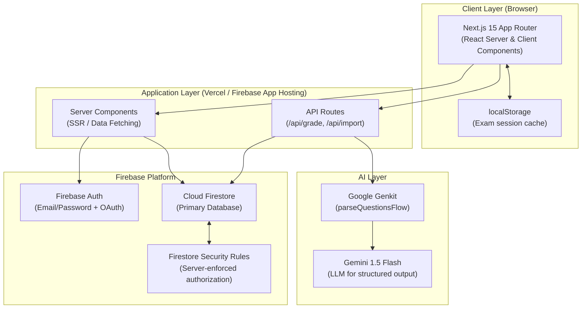

### 2.2 Request Flow Comparison

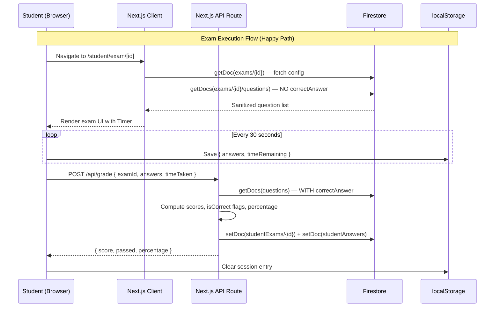

---

## 3. Technology Stack & Justification

| Layer | Technology | Version | Why This Choice |
|---|---|---|---|
| **Framework** | Next.js (App Router) | 15.5.9 | RSC for server-side fetching, nested layouts, route groups for role isolation, Turbopack for fast DX |
| **Language** | TypeScript | ^5.x | Compile-time type safety; critical for shared Zod schemas used in both form validation AND API grading |
| **Styling** | Tailwind CSS | ^3.4 | Utility-first; pairs perfectly with ShadCN's class-based theming system |
| **UI Components** | ShadCN UI (Radix UI) | Latest | Accessible, headless, fully owned in codebase — no version-lock black-box library |
| **Animations** | Framer Motion | ^11.x | Smooth page/question transitions in exam UI; used for perceived performance |
| **Database** | Firebase Firestore | ^11.x | Real-time NoSQL, sub-collections map naturally to exam→questions hierarchy, Security Rules handle auth |
| **Authentication** | Firebase Auth | ^11.x | Battle-tested, supports Email/Password + future Google/SSO providers with zero backend changes |
| **Form Management** | React Hook Form + Zod | ^7.x + ^3.x | Uncontrolled inputs = zero re-renders per keystroke; Zod schemas shared between form and API |
| **Data Tables** | TanStack Table | ^8.x | Headless, virtualization-ready for large user/result lists in admin panel |
| **Charts** | Recharts | ^2.x | React-native charting for analytics dashboards |
| **AI Orchestration** | Google Genkit | ^1.20 | Firebase-native AI framework; `parseQuestionsFlow` wraps Gemini with typed I/O and retry logic |
| **LLM** | Gemini 1.5 Flash | via Genkit | Fast structured-output model; ideal for document→JSON extraction tasks |
| **QR Code** | qrcode.react | ^3.x | SVG-based, accessible QR generation; used for exam sharing feature |
| **File Parsing** | xlsx | ^0.18 | Parse Excel/CSV in the Genkit flow — runs server-side only |
| **State (Global)** | Zustand | ^4.5 | Lightweight global store; replaces prop-drilling for theme/direction/user context |
| **State (Local)** | React Hooks | Built-in | useState/useReducer for component-level state (exam answers, timer) |
| **Email** | Resend | ^3.x | Transactional email for notifications (future milestone) |
| **Deployment** | Firebase App Hosting / Vercel | — | Serverless, edge-optimized, zero-ops scaling |

---

## 4. Data Architecture

### 4.1 Entity Relationship Diagram (ERD)

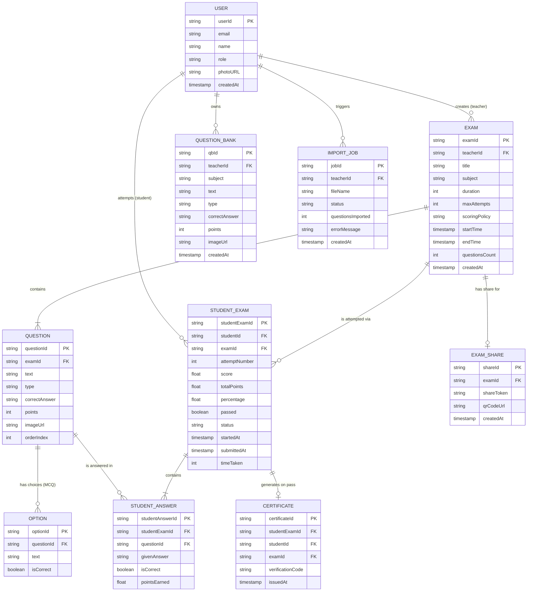

### 4.2 Firestore Collection Map

```
Firestore Root
│
├── users/                          ← All users (students, teachers, admins)
│   └── {userId}/                   ← USER document
│
├── exams/                          ← All exams
│   └── {examId}/                   ← EXAM document
│       └── questions/              ← Sub-collection
│           └── {questionId}/       ← QUESTION document (correctAnswer hidden by rules)
│
├── studentExams/                   ← Attempt records
│   └── {studentExamId}/            ← STUDENT_EXAM document
│       └── answers/                ← Sub-collection (optional future move)
│           └── {answerId}/         ← STUDENT_ANSWER document
│
├── questionBank/                   ← Teacher question repositories
│   └── {qbId}/                     ← QUESTION_BANK document
│
├── certificates/                   ← Issued certificates
│   └── {certificateId}/            ← CERTIFICATE document
│
├── examShares/                     ← Shareable exam tokens + QR URLs
│   └── {shareId}/                  ← EXAM_SHARE document
│
└── importJobs/                     ← AI import audit log
    └── {jobId}/                    ← IMPORT_JOB document
```

### 4.3 Exam Status State Machine

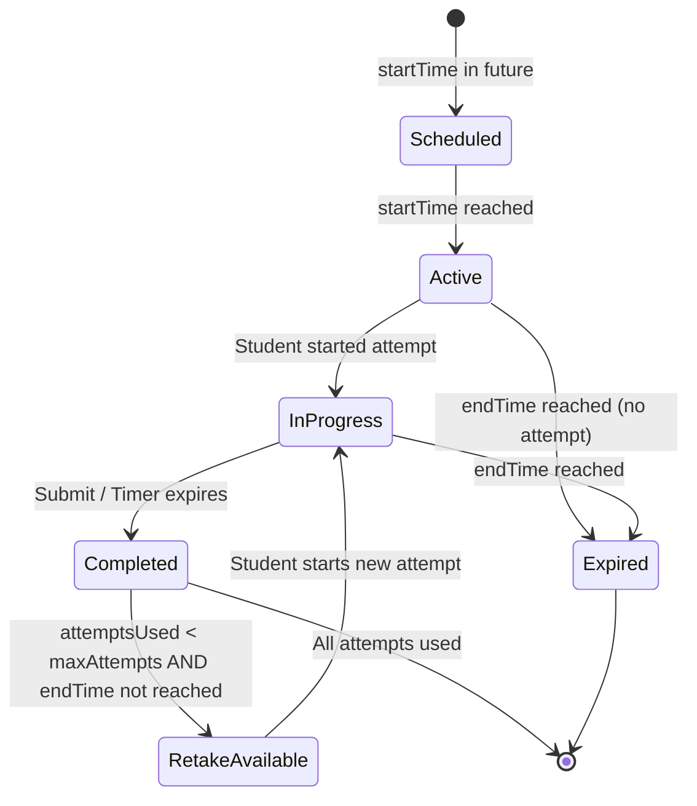

---

## 5. Application Route Map

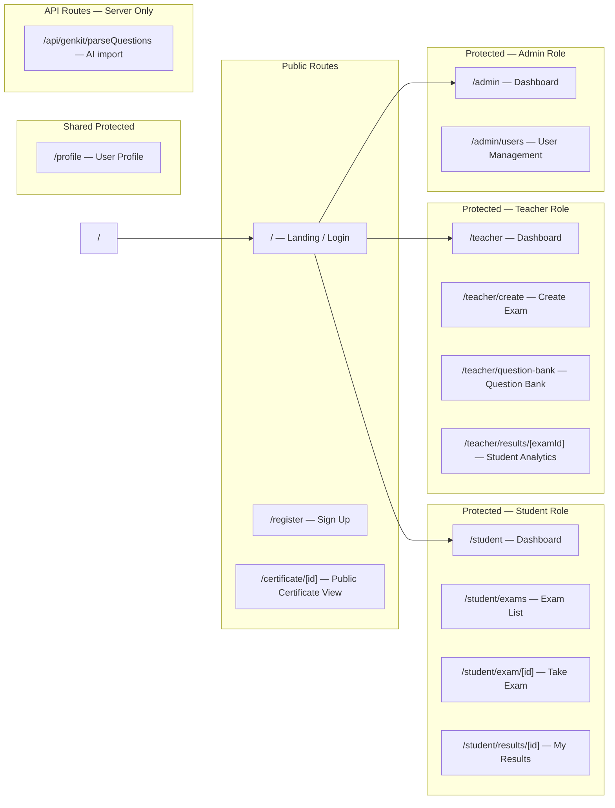

> [!NOTE]
> Route groups `(app)` and `(auth)` are used in Next.js App Router to isolate layout trees. The `(app)` layout enforces authentication and role-based redirection before rendering any child page.

---

## 6. Project Directory Structure

```
src/
├── app/
│   ├── layout.tsx                    ← Root HTML shell (fonts, metadata, providers)
│   ├── page.tsx                      ← Landing / Login page
│   ├── globals.css                   ← Design tokens, Tailwind directives
│   │
│   ├── (auth)/                       ← Auth route group (no sidebar layout)
│   │   └── register/
│   │       └── page.tsx
│   │
│   ├── (app)/                        ← Protected route group
│   │   ├── layout.tsx                ← Auth guard + role check + Sidebar + Header
│   │   ├── profile/
│   │   │   └── page.tsx
│   │   ├── student/
│   │   │   ├── page.tsx              ← Student Dashboard
│   │   │   ├── exams/
│   │   │   │   └── page.tsx          ← Exam list with dynamic status cards
│   │   │   ├── exam/
│   │   │   │   └── [id]/
│   │   │   │       └── page.tsx      ← Exam execution engine
│   │   │   └── results/
│   │   │       └── [id]/
│   │   │           └── page.tsx      ← Graded results + answer review
│   │   ├── teacher/
│   │   │   ├── page.tsx              ← Teacher Dashboard
│   │   │   ├── create/
│   │   │   │   └── page.tsx          ← Exam builder form
│   │   │   ├── question-bank/
│   │   │   │   └── page.tsx          ← Question bank table
│   │   │   └── results/
│   │   │       └── [examId]/
│   │   │           └── page.tsx      ← Per-exam student analytics
│   │   └── admin/
│   │       ├── page.tsx              ← System dashboard
│   │       └── users/
│   │           └── page.tsx          ← User management CRUD
│   │
│   ├── certificate/
│   │   └── [id]/
│   │       └── page.tsx              ← Public certificate (print-ready)
│   │
│   └── api/
│       └── genkit/
│           └── parseQuestions/
│               └── route.ts          ← AI import endpoint (POST)
│
├── ai/
│   ├── genkit.ts                     ← Genkit instance + Gemini plugin
│   ├── dev.ts                        ← Local Genkit dev server entry
│   └── flows/
│       └── parseQuestionsFlow.ts     ← Zod input/output schema + Genkit flow
│
├── components/
│   ├── providers.tsx                 ← AppContext (theme, direction, user)
│   ├── logo.tsx                      ← Quizzy brand logo component
│   ├── FirebaseErrorListener.tsx     ← Global Firebase error toast handler
│   └── ui/                           ← ShadCN components (auto-generated)
│       ├── button.tsx
│       ├── card.tsx
│       ├── dialog.tsx
│       ├── accordion.tsx
│       ├── calendar.tsx
│       ├── data-table.tsx            ← TanStack Table wrapper
│       └── ... (all ShadCN primitives)
│
├── firebase/
│   ├── index.ts                      ← Firebase app init + exported instances
│   └── provider.tsx                  ← React context exposing auth/firestore
│
├── hooks/
│   ├── useExamTimer.ts               ← Countdown + auto-submit logic
│   ├── useExamSession.ts             ← localStorage read/write for in-progress state
│   └── useRole.ts                    ← Reads current user role from Firestore
│
└── lib/
    ├── types.ts                      ← All shared TypeScript interfaces & enums
    ├── utils.ts                      ← cn() helper + misc utilities
    ├── constants.ts                  ← App-wide constants (pass threshold, roles)
    └── schemas.ts                    ← Zod schemas shared between forms & API
```

---

## 7. Phase-by-Phase Implementation Plan

### Phase Overview Timeline

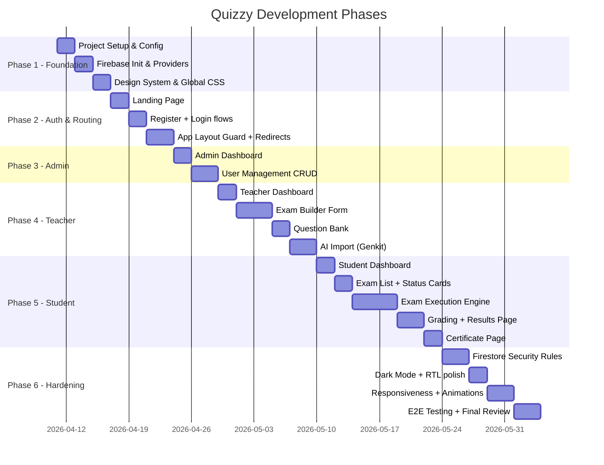

---

### Phase 1 — Foundation & Infrastructure

**Goal:** Establish a production-grade development environment with zero technical debt from day one.

#### 1.1 Project Scaffolding

```bash
# Bootstrap with Turbopack (already configured)
npx create-next-app@latest ./ --typescript --tailwind --app --src-dir

# Install all project dependencies
npm install firebase framer-motion react-hook-form @hookform/resolvers zod \
  @tanstack/react-table recharts qrcode.react xlsx zustand date-fns \
  lucide-react genkit @genkit-ai/google-genai @genkit-ai/next resend

# Initialize ShadCN UI
npx shadcn@latest init
npx shadcn@latest add button card dialog accordion calendar avatar \
  dropdown-menu sheet select separator toast progress tabs badge \
  alert-dialog radio-group checkbox switch scroll-area popover tooltip
```

#### 1.2 Design System Tokens (`globals.css`)

| Token | Light Mode | Dark Mode | Usage |
|---|---|---|---|
| `--primary` | `hsl(221 83% 53%)` | `hsl(217 91% 60%)` | Primary actions, active nav |
| `--accent` | `hsl(262 83% 67%)` | `hsl(262 80% 72%)` | Logo accent, highlights |
| `--background` | `hsl(0 0% 100%)` | `hsl(222 47% 11%)` | Page background |
| `--muted` | `hsl(210 40% 96%)` | `hsl(217 32% 17%)` | Card backgrounds |
| `--destructive` | `hsl(0 72% 51%)` | `hsl(0 66% 55%)` | Errors, delete actions |

**Typography:**
- Headlines: `Poppins` (Google Fonts, weights 600 & 700)
- Body text: `PT Sans` (Google Fonts, weights 400 & 700)

#### 1.3 Firebase Project Setup (`src/firebase/index.ts`)

```typescript
// Critical: use environment variables — never hardcode credentials
const firebaseConfig = {
  apiKey: process.env.NEXT_PUBLIC_FIREBASE_API_KEY,
  authDomain: process.env.NEXT_PUBLIC_FIREBASE_AUTH_DOMAIN,
  projectId: process.env.NEXT_PUBLIC_FIREBASE_PROJECT_ID,
  // ...
};
```

**Required `.env.local` variables:**
```
NEXT_PUBLIC_FIREBASE_API_KEY=
NEXT_PUBLIC_FIREBASE_AUTH_DOMAIN=
NEXT_PUBLIC_FIREBASE_PROJECT_ID=
NEXT_PUBLIC_FIREBASE_STORAGE_BUCKET=
NEXT_PUBLIC_FIREBASE_MESSAGING_SENDER_ID=
NEXT_PUBLIC_FIREBASE_APP_ID=
GOOGLE_GENAI_API_KEY=
```

---

### Phase 2 — Authentication & Role-Based Routing

**Goal:** Bulletproof auth guard where every page is inaccessible without valid credentials and correct role.

#### 2.1 Registration Flow

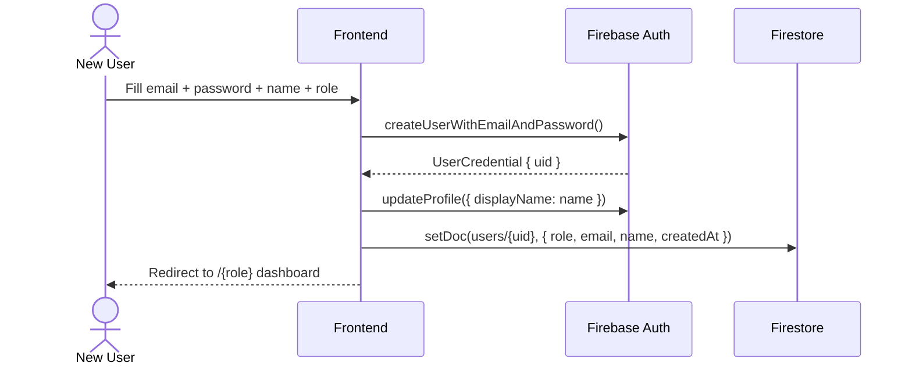

#### 2.2 App Layout Guard Logic

The `(app)/layout.tsx` implements a **2-stage guard:**

1. **Stage 1 — Auth check:** If `isUserLoading=false` and `user=null`, redirect to `/`
2. **Stage 2 — Role check:** Fetch `users/{uid}` from Firestore. If current `pathname` does not start with `/{role}`, redirect to `/{role}`

This prevents teachers from accessing `/student/*` routes and vice versa — even if they manually type the URL.

#### 2.3 Navigation Configuration (per role)

| Route | Student | Teacher | Admin |
|---|:---:|:---:|:---:|
| `/student` (Dashboard) | ✅ | ❌ | ❌ |
| `/student/exams` | ✅ | ❌ | ❌ |
| `/teacher` (Dashboard) | ❌ | ✅ | ❌ |
| `/teacher/create` | ❌ | ✅ | ❌ |
| `/teacher/question-bank` | ❌ | ✅ | ❌ |
| `/admin` (Dashboard) | ❌ | ❌ | ✅ |
| `/admin/users` | ❌ | ❌ | ✅ |
| `/profile` | ✅ | ✅ | ✅ |
| `/certificate/[id]` | ✅ | ✅ | ✅ |

---

### Phase 3 — Admin Interface

**Goal:** Give the admin full operational visibility and control before any exams are created, enabling test-user seeding.

#### 3.1 System Dashboard (`/admin`)

Stat cards showing:
- Total registered users (queried from `users` collection with `getDocs`)
- Total exams created (queried from `exams` collection)
- Active exams right now (client-side filter: `startTime <= now <= endTime`)
- Recent user registrations (last 5, ordered by `createdAt DESC`)

#### 3.2 User Management (`/admin/users`)

Built on **TanStack Table** with:

| Column | Sortable | Filterable |
|---|:---:|:---:|
| Name | ✅ | ✅ |
| Email | — | ✅ |
| Role | ✅ | ✅ (dropdown) |
| Created At | ✅ | — |
| Actions (Edit / Delete) | — | — |

**Operations:**
- **Add User:** Dialog with name/email/password/role form → `createUserWithEmailAndPassword` + Firestore `setDoc`
- **Edit Role:** Inline `Select` dropdown → `updateDoc(users/{id}, { role })`
- **Delete User:** AlertDialog confirmation → `deleteDoc(users/{id})` *(Note: Firebase Auth deletion requires Admin SDK — document this limitation)*

> [!WARNING]
> Deleting a user document from Firestore does **not** delete them from Firebase Authentication. Full deletion requires the Firebase Admin SDK from a secure server environment (API Route). This should be handled in a `/api/admin/delete-user` route using `admin.auth().deleteUser(uid)`.

---

### Phase 4 — Teacher Interface

**Goal:** A powerful, intuitive exam management suite that converts hours of question preparation into minutes.

#### 4.1 Teacher Dashboard (`/teacher`)

- **My Exams Table:** all exams where `teacherId == currentUser.uid`, with columns: Title, Subject, Status badge (Scheduled/Active/Expired), Questions Count, Actions
- **Quick Stats Cards:** Total exams, Total students who attempted, Total pending manual review (future: essay grading)
- **Action buttons per exam:**
  - 📊 View Results → `/teacher/results/[examId]`
  - 🔗 Share → opens Share Dialog
  - 🗑️ Delete → AlertDialog confirmation

#### 4.2 Exam Builder (`/teacher/create`)

Form built with `React Hook Form` + `Zod`. Schema:

```typescript
const ExamSchema = z.object({
  title:         z.string().min(3).max(100),
  subject:       z.string().min(2),
  duration:      z.number().int().min(5).max(480),    // minutes
  startTime:     z.date(),
  endTime:       z.date(),
  maxAttempts:   z.number().int().min(1).max(10),
  scoringPolicy: z.enum(['highest', 'average']),
  questions:     z.array(QuestionSchema).min(1),
});

const QuestionSchema = z.object({
  text:          z.string().min(5),
  type:          z.enum(['multiple-choice', 'true-false', 'short-text']),
  points:        z.number().int().min(1),
  correctAnswer: z.string().min(1),
  options:       z.array(z.string()).optional(),   // required if type=MCQ
  imageUrl:      z.string().url().optional(),
  orderIndex:    z.number().int(),
});
```

**Question type UI adapts dynamically:**
- `multiple-choice` → 4 text inputs for options + radio to mark correct one
- `true-false` → Toggle switch (True/False)
- `short-text` → Single text input for expected answer

#### 4.3 AI Question Import — Genkit Flow

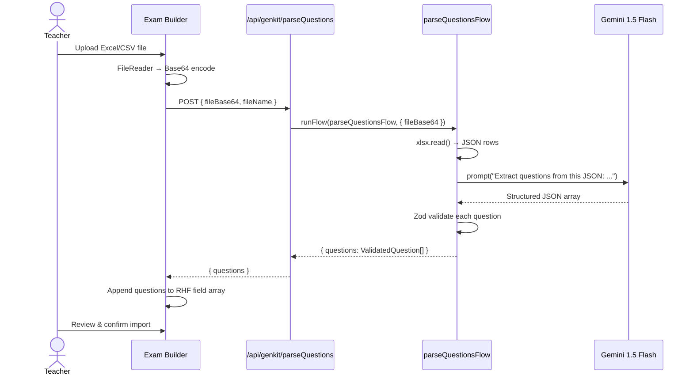

**Expected Excel column format for teachers:**
| Column | Required | Description |
|---|:---:|---|
| `text` | ✅ | Question body |
| `type` | ✅ | `multiple-choice` / `true-false` / `short-text` |
| `correctAnswer` | ✅ | Correct answer string |
| `points` | ✅ | Integer point value |
| `option1`–`option4` | ➡️ MCQ only | Answer choices |
| `imageUrl` | ❌ | Optional image link |

#### 4.4 Question Bank (`/teacher/question-bank`)

- Server-side filtered `getDocs` query: `where('teacherId', '==', uid)`
- Client-side search by `text` (debounced input, 300ms)
- Filter chips by `subject` and `type`
- Future: "Add to Exam" action from bank → pushes question into current exam builder

---

### Phase 5 — Student Interface

**Goal:** A distraction-free, reliable exam-taking experience that works even under poor network conditions.

#### 5.1 Exam Status Logic (`/student/exams`)

Each exam card computes its status **client-side** from server-fetched data:

```typescript
function computeExamStatus(exam: Exam, attempts: StudentExam[]): ExamStatus {
  const now = new Date();
  const hasStarted = now >= exam.startTime;
  const hasExpired = now > exam.endTime;
  const studentAttempts = attempts.filter(a => a.examId === exam.examId);
  const completedAttempts = studentAttempts.filter(a => a.status === 'completed');

  if (!hasStarted)                                    return 'scheduled';
  if (hasExpired && completedAttempts.length === 0)   return 'expired';
  if (completedAttempts.length >= exam.maxAttempts)   return 'completed';
  if (studentAttempts.some(a => a.status === 'in-progress')) return 'in-progress';
  if (!hasExpired && completedAttempts.length > 0 && completedAttempts.length < exam.maxAttempts)
                                                      return 'retake-available';
  return 'available';
}
```

#### 5.2 Exam Execution Engine (`/student/exam/[id]`)

**Key custom hooks:**

- **`useExamTimer(duration, onExpire)`**
  - Initializes remaining seconds from `localStorage` (resume) or `duration * 60` (fresh start)
  - `setInterval(1000)` countdown
  - Auto-calls `onExpire` → triggers `handleSubmit` when hits 0
  - Alert color change at `< 120s` remaining

- **`useExamSession(examId, studentId)`**
  - `save(state)` → `localStorage.setItem(key, JSON.stringify(state))`
  - `restore()` → `JSON.parse(localStorage.getItem(key))`
  - `clear()` → `localStorage.removeItem(key)` (called after successful submission)

**Question navigator panel:**
```
[ 1✅ ][ 2⭕ ][ 3🔖 ][ 4✅ ][ 5❓ ]
 done   skip  review  done  current
```
Color coding:
- 🟢 Green border = answered
- 🟡 Yellow border = flagged for review
- 🔵 Blue border = current question
- ⬜ Default = unanswered

#### 5.3 Grading Pipeline (Server-Side)

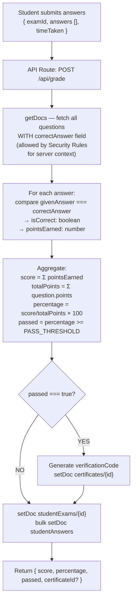

#### 5.4 Results Page (`/student/results/[id]`)

Displays:
- Hero card: Score `76 / 100` | Percentage `76%` | Status badge `PASSED ✅`
- Time taken: formatted `mm:ss`
- Attempt number: `Attempt 1 of 3`
- **Accordion review list** (one item per question):
  - Question text + optional image
  - Student's answer (highlighted red if wrong)
  - Correct answer (highlighted green)
  - Points earned: `4 / 4` or `0 / 4`

#### 5.5 Certificate Page (`/certificate/[id]`)

```
┌─────────────────────────────────────────────┐
│  🎓  CERTIFICATE OF ACHIEVEMENT              │
│                                             │
│  This certifies that                        │
│                                             │
│  ┌─ Mohamed Ahmed ────────────────────────┐ │
│  │  has successfully completed             │ │
│  │  "Advanced Mathematics — Unit 3"        │ │
│  │  with a score of  87.5%                 │ │
│  │  on April 10, 2026                      │ │
│  └────────────────────────────────────────┘ │
│                                             │
│  Verification Code: QZY-2026-A7F3           │
│  [Print Certificate]  [Back to Dashboard]   │
└─────────────────────────────────────────────┘
```

`@media print` CSS hides: sidebar, header, buttons, browser chrome.  
Only the certificate card is printed.

---

### Phase 6 — Security, Polish & Hardening

**Goal:** Production-ready quality. Zero security gaps, pixel-perfect UI, and a smooth experience across all devices.

#### 6.1 Firestore Security Rules

```javascript
rules_version = '2';
service cloud.firestore {
  match /databases/{database}/documents {

    // ── Helper Functions ───────────────────────────────────────────
    function isAuthenticated() {
      return request.auth != null;
    }
    function getRole() {
      return get(/databases/$(database)/documents/users/$(request.auth.uid)).data.role;
    }
    function isOwner(userId) {
      return request.auth.uid == userId;
    }

    // ── Users Collection ───────────────────────────────────────────
    match /users/{userId} {
      allow read: if isAuthenticated();
      allow create: if isAuthenticated() && isOwner(userId);
      allow update: if isAuthenticated() && (isOwner(userId) || getRole() == 'admin');
      allow delete: if isAuthenticated() && getRole() == 'admin';
    }

    // ── Exams Collection ──────────────────────────────────────────
    match /exams/{examId} {
      allow read: if isAuthenticated();
      allow create: if isAuthenticated()
                    && getRole() == 'teacher'
                    && request.resource.data.teacherId == request.auth.uid;
      allow update, delete: if isAuthenticated()
                    && resource.data.teacherId == request.auth.uid;

      // Questions Sub-collection
      match /questions/{questionId} {
        // KEY SECURITY: correctAnswer is part of the document but
        // the client query in exam execution explicitly excludes it using field masks.
        // This rule allows read but the API Route handles grading server-side.
        allow read: if isAuthenticated();
        allow write: if isAuthenticated()
                     && get(/databases/$(database)/documents/exams/$(examId)).data.teacherId == request.auth.uid;
      }
    }

    // ── Student Exams ─────────────────────────────────────────────
    match /studentExams/{studentExamId} {
      allow read: if isAuthenticated()
                  && (resource.data.studentId == request.auth.uid
                      || getRole() == 'teacher'
                      || getRole() == 'admin');
      allow create: if isAuthenticated()
                    && request.resource.data.studentId == request.auth.uid;
      allow update: if isAuthenticated()
                    && resource.data.studentId == request.auth.uid;
    }

    // ── Certificates ──────────────────────────────────────────────
    match /certificates/{certificateId} {
      allow read: if true;  // Public — valid for certificate sharing
      allow write: if false; // Written only by server (API Route with Admin SDK)
    }

    // ── Question Bank ─────────────────────────────────────────────
    match /questionBank/{qbId} {
      allow read, write: if isAuthenticated()
                         && resource.data.teacherId == request.auth.uid;
      allow create: if isAuthenticated()
                    && request.resource.data.teacherId == request.auth.uid;
    }
  }
}
```

#### 6.2 Dark Mode & RTL Implementation

- Dark mode: Tailwind `dark:` classes + `class="dark"` toggle on `<html>` via `Zustand` store persisted to `localStorage`
- RTL: `dir="rtl"` on the `(app)/layout.tsx` outer div, driven by `useApp()` context
- Components use `logical CSS properties` where possible (`ms-`, `me-`, `ps-`, `pe-`)

#### 6.3 Responsive Breakpoints

| Breakpoint | Width | Layout |
|---|---|---|
| Mobile | `< 768px` | Bottom nav drawer (Sheet) replaces sidebar |
| Tablet | `768px–1024px` | 220px sidebar + content |
| Desktop | `> 1024px` | 280px sidebar + content |

#### 6.4 Animation Strategy (Framer Motion)

| Element | Animation | Config |
|---|---|---|
| Exam question transition | `AnimatePresence` + slide | `x: ±300, opacity: 0→1, duration: 0.3s` |
| Dashboard stat cards | Staggered fade-in | `staggerChildren: 0.08s` |
| Result score counter | Spring animation | `type: 'spring', stiffness: 80` |
| Page transitions | Fade | `opacity: 0→1, duration: 0.2s` |
| Alert/toast pop-in | Scale + fade | `scale: 0.9→1, duration: 0.15s` |

---

## 8. Security Strategy

### Threat Model & Mitigations

| Threat | Attack Vector | Mitigation |
|---|---|---|
| **Answer extraction** | Student calls Firestore directly to fetch `correctAnswer` | Answers only fetched server-side in API Route during grading |
| **Cross-role access** | Teacher manually navigates to `/admin/users` | App layout redirects; Firestore rules deny writes |
| **Score tampering** | Student sends fake score in form submission | Score is computed server-side from source-of-truth questions, never trusted from client |
| **Multiple attempts fraud** | Student bypasses `maxAttempts` check | `attemptNumber` is computed server-side; Security Rules prevent extra writes |
| **Fake certificate** | User crafts certificate URL | `verificationCode` is a UUID generated server-side; readable but not writable by clients |
| **Unauthorized exam deletion** | Teacher deletes another teacher's exam | Firestore rule: `resource.data.teacherId == request.auth.uid` |
| **Privilege escalation** | Student changes their own `role` field | Firestore rule: only Admin can update `role` field |
| **Session hijacking** | localStorage poisoning on shared device | `localStorage` key is scoped to `examId + studentId`; stale data is cleared on submission |

---

## 9. API Contract

### POST `/api/genkit/parseQuestions`

**Request:**
```typescript
{
  fileBase64: string;     // Base64-encoded Excel/CSV content
  fileName: string;       // Original file name (for IMPORT_JOB audit)
}
```

**Response (200 OK):**
```typescript
{
  questions: Array<{
    text: string;
    type: 'multiple-choice' | 'true-false' | 'short-text';
    correctAnswer: string;
    points: number;
    options?: string[];
    imageUrl?: string;
    orderIndex: number;
  }>;
  importedCount: number;
  skippedCount: number;
}
```

**Error Responses:**
| Code | Reason |
|---|---|
| `400` | Invalid file format / Zod validation failure |
| `401` | Unauthenticated request |
| `403` | User is not a `teacher` role |
| `429` | Rate limit exceeded (Gemini API quota) |
| `500` | Genkit flow internal error |

---

### POST `/api/grade`

**Request:**
```typescript
{
  examId: string;
  answers: Array<{ questionId: string; givenAnswer: string }>;
  timeTaken: number;     // seconds
  attemptNumber: number;
}
```

**Response (200 OK):**
```typescript
{
  studentExamId: string;
  score: number;
  totalPoints: number;
  percentage: number;
  passed: boolean;
  certificateId?: string;   // only if passed === true
}
```

---

## 10. Testing Strategy

### Testing Pyramid

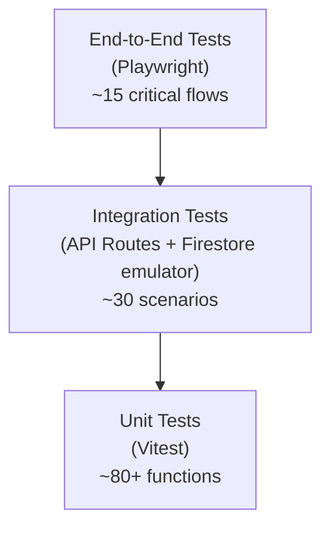

### Unit Test Coverage Targets

| Module | Target | Key Tests |
|---|:---:|---|
| `computeExamStatus()` | 100% | All 6 status transitions |
| `useExamTimer` hook | 90% | Countdown, auto-submit, color change threshold |
| `useExamSession` hook | 90% | Save/restore/clear, stale data handling |
| `parseQuestionsFlow` | 85% | Valid Excel, missing columns, corrupted file |
| Grading algorithm | 100% | MCQ correct/wrong, short-text, score calculation, pass/fail |
| Zod schemas | 95% | Valid/invalid inputs for all fields |

### Critical E2E Flows (Playwright)

1. **Full student exam journey:** Register → See exam → Start → Answer all → Submit → View results → View certificate
2. **Exam resume:** Start exam → Close tab → Reopen → Verify answers & timer restored from localStorage
3. **Timer auto-submit:** Start exam with 1-minute duration → Wait → Verify auto-graded result
4. **Teacher creates exam + AI import:** Login as teacher → Create exam → Upload Excel → Verify questions populated → Publish
5. **Admin role change:** Login as admin → Change a student to teacher → Verify new routing
6. **Cross-role access denial:** Login as student → Navigate to `/admin/users` → Verify redirect

---

## 11. Performance Targets

| Metric | Target | Measurement Tool |
|---|---|---|
| **LCP** (Largest Contentful Paint) | `< 2.0s` | Lighthouse |
| **FID** / **INP** | `< 100ms` | Chrome DevTools |
| **CLS** | `< 0.05` | Lighthouse |
| **Time to First Byte (TTFB)** | `< 200ms` | WebPageTest |
| **Bundle size (initial)** | `< 150KB gzipped` | `@next/bundle-analyzer` |
| **Firestore reads per exam load** | `≤ 3 reads` | Firebase Console |
| **Exam question render time** | `< 16ms` (60fps) | React DevTools Profiler |

### Optimization Strategies

- **Server Components** for all pages that display static or once-fetched data (dashboard stats, exam list)
- **`use client`** only when: `useState`, `useEffect`, event handlers, or browser APIs are needed
- **Firestore field masks** — only request needed fields (never fetch `correctAnswer` to client)
- **Image optimization** — `next/image` for all question images with lazy loading
- **Code splitting** — Dynamic imports for heavy components (Calendar, Chart, QR Code)
- **`React.memo`** on QuestionCard to prevent re-renders on every timer tick

---

## 12. CI/CD & Deployment Pipeline

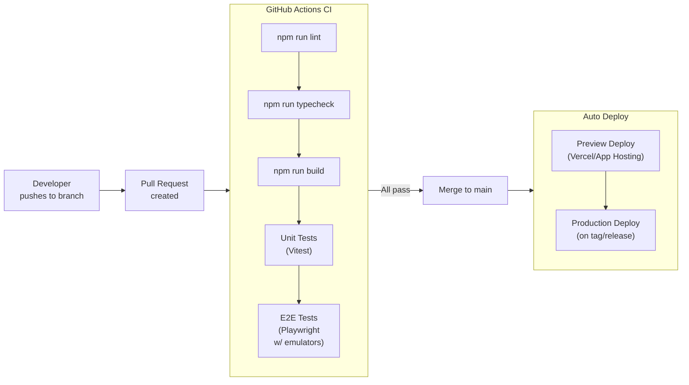

### Environments

| Environment | Branch | Firebase Project | Purpose |
|---|---|---|---|
| Development | `feature/*` | `quizzy-dev` | Local development, emulators |
| Staging | `main` | `quizzy-staging` | QA, integration testing |
| Production | `release/*` | `quizzy-prod` | Live users |

> [!CAUTION]
> Production Firestore Security Rules must be independently deployed and reviewed. **Never** use `allow read, write: if true;` in production. All rule changes require a separate PR and peer review before deployment.

---

## 13. Risk Register

| # | Risk | Probability | Impact | Mitigation |
|---|---|:---:|:---:|---|
| R1 | Student submits exam on poor connection | High | High | localStorage auto-save every 30s; retry mechanism on submit |
| R2 | Genkit/Gemini API rate limit exceeded | Medium | Medium | Exponential backoff in flow; fallback to manual question entry |
| R3 | Firebase Firestore quota exhaustion | Low | High | Query optimization (field masks, pagination); monitor in Firebase Console |
| R4 | Firestore Security Rules misconfiguration | Medium | Critical | Rules unit tests with Firebase Emulator; mandatory peer review |
| R5 | Teacher uploads malformed Excel file | High | Low | Zod validation + Genkit error handling returns clear error message to UI |
| R6 | Score discrepancy (client vs server) | Low | High | Grading is 100% server-side; client never computes final score |
| R7 | localStorage cleared by browser | Low | Medium | Warn user before exam; offer manual save reminder |
| R8 | Concurrent write conflicts on exam delete | Low | Medium | Soft-delete pattern (mark as `archived: true`) instead of hard `deleteDoc` |

---

> **Document Status:** Ready for Engineering Review  
> **Next Step:** Team sign-off → Begin Phase 1 execution
