# 🏗️ Quizzy — High-Level System Architecture

> **Graduation Project | Academic E-Examination Platform**
> Built with: Next.js 15 · TypeScript · Firebase · Google Genkit · Gemini 1.5 Flash

---

## 1. Architecture Overview

**Quizzy** follows a **3-tier, role-isolated, serverless architecture** deployed on Firebase App Hosting. The system cleanly separates concerns across four logical layers:

| Layer | Responsibility |
|---|---|
| **Frontend (Client)** | Renders role-specific portals (Student / Teacher / Admin), handles exam session state locally, provides the UI skin |
| **Backend / Logic** | Next.js Server Components for SSR data fetching + API Routes for secure server-side grading and AI-powered question import |
| **Database / Storage** | Firebase Firestore (NoSQL) as the single source of truth; Firebase Authentication for identity |
| **External AI Services** | Google Genkit orchestration layer calling Gemini 1.5 Flash for structured bulk question parsing |

The most critical security design decision is that **`correctAnswer` fields are never exposed to the browser** — all grading is computed exclusively inside the `/api/grade` server-side API Route, then written directly to Firestore from the server.

---

## 2. Mermaid.js Architecture Diagram

```mermaid
flowchart TD
    %% ─── ACTOR LAYER ───────────────────────────────────────────
    STU(["🎓 Student"])
    TCH(["📚 Teacher"])
    ADM(["🛡️ Admin"])

    %% ─── FRONTEND LAYER (Browser) ──────────────────────────────
    subgraph FRONTEND["🖥️ Frontend — Next.js 15 App Router (Browser)"]
        direction TB
        SPUB["Public Pages\n/ · /register · /certificate/[id]"]
        SPORT["Student Portal\n/student · /student/exams\n/student/exam/[id] · /student/results/[id]"]
        TPORT["Teacher Portal\n/teacher · /teacher/create\n/teacher/question-bank · /teacher/results/[examId]"]
        APORT["Admin Portal\n/admin · /admin/users"]
        AUTH_GUARD["Layout Auth Guard\nRole Check → Redirect"]
        LOCAL["🗄️ localStorage\nAuto-save Exam Session\n(answers · timeRemaining)"]
        ZUSTAND["Zustand Global State\n(user · theme · direction)"]
        FRAMER["Framer Motion\nAnimations & Transitions"]
        QR["QR Code Generator\n(qrcode.react)"]
    end

    %% ─── BACKEND / LOGIC LAYER ─────────────────────────────────
    subgraph BACKEND["⚙️ Backend / Logic — Next.js API Routes + Server Components"]
        direction TB
        RSC["React Server Components\nSSR · Firestore data fetch\n(no correctAnswer leak)"]
        GRADE["/api/grade\nServer-Side Grading Engine\n• Fetch correctAnswers\n• Compute score / percentage / passed\n• Write studentExam & studentAnswers\n• Issue certificate on pass"]
        AI_API["/api/genkit/parseQuestions\nAI Import Endpoint\n• Receive Base64 Excel/CSV\n• Invoke parseQuestionsFlow\n• Return structured questions"]
        ZOD["Zod Schemas\nShared Form ↔ API Validation"]
        RHF["React Hook Form\nExam Builder Form State"]
    end

    %% ─── FIREBASE PLATFORM ─────────────────────────────────────
    subgraph FIREBASE["🔥 Firebase Platform (BaaS)"]
        direction TB
        FA["Firebase Authentication\nEmail/Password · OAuth-ready\nJWT token issuance"]
        FS["Cloud Firestore\nNoSQL Database\ncollections: users · exams · questions\nstudentExams · studentAnswers\ncertificates · questionBank\nexamShares · importJobs"]
        RULES["Firestore Security Rules\n• correctAnswer server-only\n• Role-based write guards\n• Certificate: read=public, write=server\n• Admin-only role escalation"]
        HOSTING["Firebase App Hosting\nNext.js SSR deployment\nCDN + auto-scaling"]
    end

    %% ─── AI LAYER ───────────────────────────────────────────────
    subgraph AI["🤖 AI Layer — Google Genkit + Gemini"]
        direction TB
        GENKIT["Google Genkit\nparseQuestionsFlow\n• xlsx.read() → JSON rows\n• Build structured prompt\n• Zod I/O schema"]
        GEMINI["Gemini 1.5 Flash\nGoogle AI API\nStructured JSON output\nBulk question extraction"]
    end

    %% ─── EXTERNAL SERVICES ──────────────────────────────────────
    subgraph EXT["🌐 External Services"]
        GFONTS["Google Fonts\nPoppins · PT Sans"]
        RESEND["Resend (Planned)\nTransactional Email\nExam notifications"]
    end

    %% ─── DATA FLOW ARROWS ───────────────────────────────────────

    %% Actors to Frontend
    STU --> SPORT
    TCH --> TPORT
    ADM --> APORT

    %% Frontend internal
    SPUB & SPORT & TPORT & APORT --> AUTH_GUARD
    SPORT <--> LOCAL
    TPORT --> QR
    SPORT & TPORT & APORT --> ZUSTAND
    SPORT --> FRAMER
    TPORT --> RHF

    %% Frontend → Backend
    SPORT -->|"POST answers"| GRADE
    TPORT -->|"POST Base64 file"| AI_API
    AUTH_GUARD --> RSC

    %% Backend internal
    RSC -->|"Fetch exam/questions (masked)"| FS
    GRADE -->|"Fetch correctAnswers (server-only)"| FS
    GRADE -->|"Write attempt record"| FS
    AI_API --> GENKIT
    RHF --> ZOD
    ZOD --> GRADE

    %% Backend → Firebase Auth
    RSC --> FA
    AUTH_GUARD --> FA

    %% Firestore ↔ Security Rules
    FS <-->|"enforces"| RULES

    %% AI internal
    GENKIT -->|"Prompt + schema"| GEMINI
    GEMINI -->|"Structured JSON"| GENKIT
    GENKIT -->|"Validated questions"| AI_API

    %% Firebase hosting
    HOSTING -->|"Serves"| FRONTEND
    HOSTING -->|"Runs"| BACKEND

    %% External
    FRONTEND --- GFONTS
    BACKEND -.->|"Future"| RESEND

    %% Styling
    classDef actor fill:#4F46E5,stroke:#312E81,color:#fff,rx:20
    classDef layer fill:#1e293b,stroke:#334155,color:#94a3b8
    classDef ai fill:#065F46,stroke:#047857,color:#D1FAE5
    classDef ext fill:#7C2D92,stroke:#6B21A8,color:#F3E8FF
    class STU,TCH,ADM actor
```



---

## 3. Textual Layout (for PowerPoint / draw.io)

Use this as your visual guide when redrawing manually. Each box represents a component, and the arrows indicate data flow direction.

```
┌──────────────────────────────────────────────────────────────────────────┐
│                           ACTOR LAYER                                     │
│     [🎓 Student]          [📚 Teacher]           [🛡️ Admin]              │
└────────┬──────────────────────┬──────────────────────┬────────────────────┘
         │                      │                      │
         ▼                      ▼                      ▼
┌──────────────────────────────────────────────────────────────────────────┐
│                   FRONTEND — Next.js 15 App Router                        │
│                                                                            │
│  [Layout Auth Guard → Role Check → Redirect]                              │
│                                                                            │
│  ┌──────────────────┐  ┌──────────────────┐  ┌──────────────────┐        │
│  │  Student Portal  │  │  Teacher Portal  │  │   Admin Portal   │        │
│  │  /student/*      │  │  /teacher/*      │  │   /admin/*       │        │
│  └──────────────────┘  └──────────────────┘  └──────────────────┘        │
│                                                                            │
│  [localStorage — Auto-save Session]  [Zustand — Global State]            │
│  [Framer Motion — Animations]        [QR Code Generator]                  │
│  [React Hook Form + Zod — Exam Builder]                                   │
│  [Public Pages: / · /register · /certificate/[id]]                        │
└──────────┬──────────────────────────────────────────────────────────────-─┘
           │ HTTP Requests (POST answers / POST file)
           ▼
┌──────────────────────────────────────────────────────────────────────────┐
│               BACKEND / LOGIC — Next.js API Routes + SSR                  │
│                                                                            │
│  ┌─────────────────────────────────┐  ┌────────────────────────────────┐  │
│  │  React Server Components (SSR) │  │  /api/grade                    │  │
│  │  • Fetch masked exam data       │  │  • Fetch correctAnswers        │  │
│  │  • No correctAnswer leak        │  │  • Score computation           │  │
│  └─────────────────────────────────┘  │  • Write studentExam record   │  │
│                                        │  • Issue certificate on pass  │  │
│  ┌─────────────────────────────────┐  └────────────────────────────────┘  │
│  │  /api/genkit/parseQuestions     │                                       │
│  │  • Receive Base64 Excel/CSV     │  ← ── ── [AI LAYER] ── ── ──►       │
│  │  • Invoke parseQuestionsFlow    │                                       │
│  │  • Return structured questions  │                                       │
│  └─────────────────────────────────┘                                       │
└──────────┬──────────────────────────────────────────────────────────────-─┘
           │ SDK calls (Firestore, Auth)
           ▼
┌──────────────────────────────────────────────────────────────────────────┐
│                   DATABASE / STORAGE — Firebase Platform                  │
│                                                                            │
│  ┌─────────────────┐  ┌──────────────────────┐  ┌────────────────────┐   │
│  │ Firebase Auth   │  │  Cloud Firestore      │  │  Security Rules    │   │
│  │ JWT · Email/PW  │  │  users · exams        │  │  Role-based write  │   │
│  │ OAuth-ready     │  │  questions · results  │  │  correctAnswer:    │   │
│  └─────────────────┘  │  certificates         │  │  server-only       │   │
│                        │  questionBank         │  └────────────────────┘   │
│                        │  importJobs           │                            │
│                        └──────────────────────┘                            │
└──────────────────────────────────────────────────────────────────────────-┘
           ▲
           │ Prompt + Zod schema → Structured JSON response
┌──────────┴──────────────────────────────────────────────────────────────-─┐
│                   AI LAYER — Google Genkit + Gemini                        │
│                                                                            │
│  ┌────────────────────────────────────────────────────────────────────┐   │
│  │  Google Genkit — parseQuestionsFlow                                 │   │
│  │  • xlsx.read() → JSON rows                                          │   │
│  │  • Build structured prompt with Zod output schema                  │   │
│  │  • Validate response with Zod before returning                     │   │
│  └──────────────────────────────┬─────────────────────────────────────┘   │
│                                  │ REST API call                            │
│  ┌───────────────────────────────▼─────────────────────────────────────┐  │
│  │  Gemini 1.5 Flash (Google AI API)                                    │  │
│  │  • Structured JSON output mode                                       │  │
│  │  • Bulk question extraction from unstructured spreadsheet data      │  │
│  └─────────────────────────────────────────────────────────────────────┘  │
└──────────────────────────────────────────────────────────────────────────-┘
```

---

## 4. Key Data Flows (Summary)

| Flow | Path |
|---|---|
| **Student takes exam** | Student → Student Portal → localStorage (auto-save) → `/api/grade` → Firestore (write result) → Results Page |
| **Teacher creates exam** | Teacher → Exam Builder (RHF+Zod) → Firestore (write exam+questions) |
| **Teacher imports questions (AI)** | Teacher → Upload Excel → `/api/genkit/parseQuestions` → Genkit → Gemini → Structured JSON → Exam Builder |
| **Admin manages users** | Admin → Admin Portal → Firestore (CRUD users, role assignment) |
| **Certificate issuance** | `/api/grade` (server) → Firestore `certificates/` → `/certificate/[id]` (public read) |
| **Exam sharing** | Teacher → QR Code generator → Firestore `examShares/` → Student scans → Login → Exam |

---

## 5. Scalability Improvement Recommendations

### 🔵 Improvement 1 — Introduce a Redis / Upstash Cache Layer

**Problem:** Every student loading `/student/exams` triggers live Firestore reads for all exams and their statuses — cost grows O(n) with concurrent students.

**Solution:** Add **Upstash Redis** (serverless, Edge-compatible) as a caching layer in front of Firestore reads. Cache exam metadata (title, schedule, policies) with a TTL of 60 seconds. Only invalidate on teacher save or admin update.

**Impact:**
- Reduces Firestore read costs by ~70–80% under load
- Drops average page load latency from ~400ms → ~50ms on cache hit
- Enables 10× more concurrent students with no Firestore quota impact

---

### 🟢 Improvement 2 — Move Grading to a Firebase Cloud Function (Background Worker)

**Problem:** The `/api/grade` API Route is synchronous — the student waits for grading, Firestore writes, and certificate issuance to complete in a single HTTP request. Under load, this creates response latency and cold-start risk.

**Solution:** Refactor to a **two-phase submit**:
1. `/api/grade` immediately acknowledges submission and writes a `pendingGrade` job to Firestore.
2. A **Firebase Cloud Function** (Firestore trigger) picks up the job, runs grading, writes results, and issues the certificate asynchronously.
3. The student results page subscribes via **Firestore `onSnapshot`** listener and renders when the result appears.

**Impact:**
- Submit response time drops from ~800ms → ~80ms (instant acknowledgment)
- Grading work scales horizontally via Cloud Functions auto-scaling
- Eliminates timeout risk for large exams (100+ questions)

---

### 🟣 Improvement 3 — Add a CDN Edge Layer for Certificate Verification

**Problem:** `/certificate/[id]` is a public, print-optimized page served by the Next.js SSR server on every request — even for already-issued, immutable certificates.

**Solution:** Deploy certificate pages as **Incremental Static Regeneration (ISR)** with `revalidate: false` after first generation (since certificates never change). Serve them from **Vercel's/Firebase's CDN edge** globally.

**Additionally:** Store the printable certificate as a **PDF in Firebase Storage** (generated server-side via Puppeteer or a PDF API on first issue) so subsequent requests return a static file from CDN with sub-10ms TTFB.

**Impact:**
- Zero server computation on certificate re-visits
- Global sub-50ms certificate load from CDN edge nodes
- Decouples certificate delivery entirely from your Next.js server capacity

